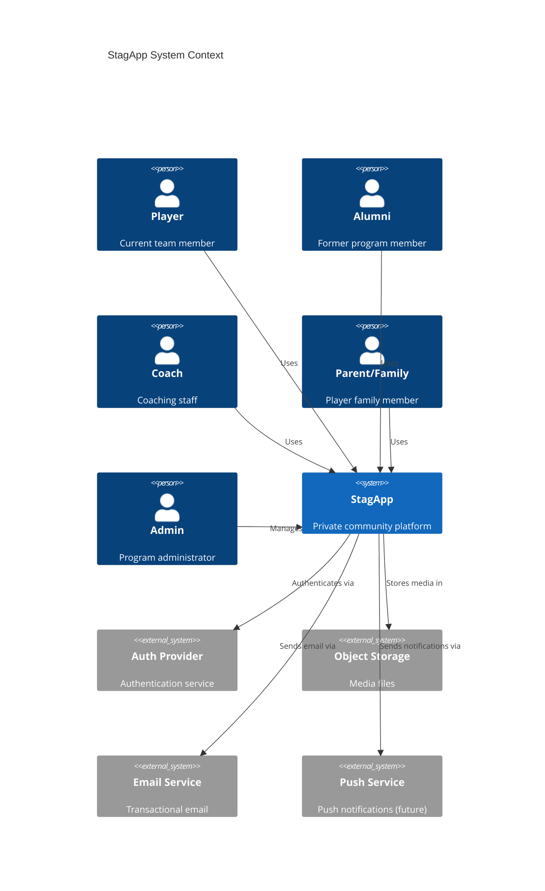
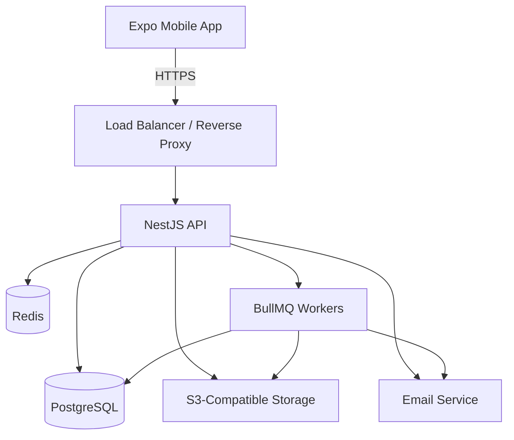
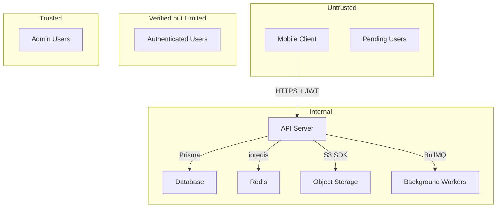

# StagApp Architecture

> Technical source of truth for the StagApp platform.
> All implementation decisions must align with this document.
> Last updated: 2026-08-31

---

## Architecture Challenge Report

Before finalizing the architecture, the following concerns were evaluated:

### Unnecessary Complexity Risks
- **Real-time messaging from day one:** Building a full chat system is one of the most complex features. It should be deferred past MVP. Team announcements (one-way) are simpler and more immediately useful.
- **Video hosting:** Self-hosting video transcoding and streaming is expensive and complex. Use signed URLs to cloud storage with client-side playback instead.
- **Push notifications in MVP:** These require native configuration, certificate management, and a delivery pipeline. Defer to post-MVP unless team announcements are P0.
- **Search:** Full-text search across posts, profiles, and events adds significant infrastructure. Start with simple database queries; add dedicated search later.

### Missing Requirements Identified
- **Content moderation:** A private community still needs moderation tooling (flagging, reporting, content review).
- **Onboarding flow:** How do new members discover the app and get approved? This needs explicit design.
- **Offline support:** Mobile apps in areas with poor connectivity (travel, stadiums) need basic offline capability.
- **Data export:** Members should be able to export their own data (GDPR-adjacent, good practice).
- **Account deactivation/deletion:** Required by app store policies.

### Security Concerns
- **Member verification is a critical trust boundary.** If anyone can join, the "private community" promise is broken. Verification must be robust.
- **Media privacy:** Photos/videos of minors (current players) require extra care. Ensure media cannot be hotlinked or scraped.
- **Direct messaging:** Private messages create legal liability. Consider retention policies and abuse reporting.
- **Admin privilege escalation:** With a small user base, admin compromise is high-impact.

### Questionable Assumptions Challenged
- **"Eventually available on iOS, Android, and web"** — Building for three platforms simultaneously is expensive. Recommendation: Start mobile-only (Expo handles both iOS/Android). Add web only if there's clear demand.
- **Alumni networking** — This is vague. Define the specific interactions (directory search? messaging? job board?) before building anything.
- **Private groups** — Groups within a private community add complexity. Ensure there's a real use case beyond what roles and team structure already provide.

### Features That Should Be Postponed Beyond MVP
- Direct messaging and group conversations (complex, liability)
- Private groups (roles may suffice initially)
- Alumni networking features beyond a directory
- Search (use simple filters initially)
- Push notifications (use in-app notifications first)
- Donations/payments/fundraising (explicitly stated)

### Architectural Decisions That Would Create Unnecessary Maintenance
- Choosing GraphQL for a small team (REST is simpler, sufficient, and better tooled for this scale)
- Microservices architecture (monolith is correct for a small team)
- Self-hosting auth (use a proven auth library or managed service)
- Building a custom CMS for team news (structured posts are sufficient)

---

## Purpose

StagApp is a private community platform for a university soccer program. It provides a trusted digital space for players, alumni, coaches, parents, and approved community members to stay connected, share updates, and coordinate activities.

It is explicitly **not** a public social network. There are no follower counts, algorithmic feeds, viral mechanics, or public-facing profiles.

---

## Product Boundaries

### In Scope
- Private, invitation-based community
- Role-based membership (player, alumni, coach, parent/family, admin)
- Member verification and approval workflows
- User profiles and directories
- Community posts with photos and comments
- Team announcements
- Event and game schedule management
- Media galleries
- In-app notifications
- Admin moderation tools

### Out of Scope (MVP)
- Direct messaging / group conversations
- Push notifications
- Full-text search
- Alumni networking beyond directory
- Private sub-groups
- Payments, donations, fundraising, ticketing, merchandise
- Web application
- Public-facing pages

### Explicit Non-Goals
- Follower/following mechanics
- Algorithmic content ranking or recommendations
- Reels, stories, or short-form video features
- Public popularity metrics (like counts visible to others)
- Engagement farming or gamification
- Viral sharing or public discovery
- Influencer or creator tooling
- Ad-supported content

---

## User Types

| Role | Description | Trust Level |
|------|-------------|-------------|
| **Player** | Current roster member | Verified |
| **Alumni** | Former player or program participant | Verified |
| **Coach** | Current coaching staff | Elevated |
| **Parent/Family** | Family member of a current player | Verified |
| **Admin** | Program administrator | Privileged |
| **Pending** | Registered but not yet approved | Untrusted |

All users except Admins start as Pending and must be verified before accessing community content.

---

## Main Use Cases

1. **Onboarding:** User receives invitation, registers, submits verification, gets approved
2. **Browse feed:** View community posts, announcements, and photos
3. **Create post:** Share text, photos, or video with the community
4. **View profiles:** Look up players, alumni, and coaches in directories
5. **View events:** See upcoming games, practices, and community events
6. **React and comment:** Engage with community posts
7. **Receive notifications:** Get notified of relevant activity
8. **Admin moderation:** Approve members, manage content, handle reports

---

## System Context



---

## Technology Stack

### Decision Rationale

| Option | Evaluation | Decision |
|--------|-----------|----------|
| **React Native / Expo** | Cross-platform, TypeScript, OTA updates, large ecosystem, Expo handles build complexity | **Selected** |
| Flutter | Good performance, Dart has smaller ecosystem, fewer available developers | Rejected |
| Native iOS/Android | Best UX but doubles development cost, impractical for small team | Rejected |
| **NestJS** | Structured Node.js framework, TypeScript, DI, guards, interceptors, great for APIs | **Selected** |
| Express.js | Too minimal — would require assembling structure manually | Rejected |
| Next.js | Full-stack web framework, not ideal as a mobile API backend | Rejected (for backend) |
| **PostgreSQL** | Robust relational DB, excellent for structured data with relationships | **Selected** |
| Firebase/Firestore | NoSQL makes relational queries difficult, vendor lock-in to Google | Rejected |
| Supabase | Good accelerator but adds coupling; we want full backend control | Rejected (as primary) |
| **Prisma** | Type-safe ORM for TypeScript, excellent DX, schema-driven | **Selected** |
| **Redis** | Caching, rate limiting, session store, job queues | **Selected** |
| **BullMQ** | Reliable background job processing on Redis | **Selected** |
| **S3-compatible storage** | Industry standard, works with AWS S3, Cloudflare R2, MinIO | **Selected** |

### Chosen Stack

| Layer | Technology | Rationale |
|-------|-----------|-----------|
| Mobile client | Expo (React Native) + TypeScript | Cross-platform, OTA updates, excellent DX |
| State management | Zustand + TanStack Query | Simple, performant, minimal boilerplate |
| Navigation | Expo Router | File-based routing, deep linking support |
| Backend framework | NestJS + TypeScript | Structured, testable, production-grade |
| ORM | Prisma | Type-safe database access, migrations |
| Database | PostgreSQL 16 | Relational integrity, JSON support, mature |
| Cache / Rate limiting | Redis | Fast, versatile, BullMQ compatible |
| Background jobs | BullMQ | Reliable queues, retries, scheduling |
| Object storage | S3-compatible (R2 or S3) | Cost-effective media storage |
| Email | Resend or AWS SES | Transactional email delivery |
| Auth | NestJS Passport + JWT | Proven pattern, no external dependency |
| Testing (backend) | Jest + Supertest | Standard Node.js testing |
| Testing (mobile) | Jest + React Native Testing Library | Component and integration testing |
| CI/CD | GitHub Actions | Integrated with repository |
| Containerization | Docker + Docker Compose | Consistent environments |

---

## Client Architecture

```
app/                    # Expo Router file-based routes
  (auth)/               # Authentication screens (public)
    login.tsx
    register.tsx
    verify.tsx
  (app)/                # Authenticated screens
    (tabs)/             # Bottom tab navigator
      feed.tsx
      directory.tsx
      events.tsx
      profile.tsx
    post/[id].tsx
    user/[id].tsx
    event/[id].tsx
    settings/
    admin/              # Admin-only screens
src/
  api/                  # API client layer (typed fetch wrappers)
  components/           # Reusable UI components
    ui/                 # Primitive components (Button, Input, Card)
    feed/               # Feed-specific components
    profile/            # Profile-specific components
  hooks/                # Custom React hooks
  stores/               # Zustand state stores
  utils/                # Pure utility functions
  types/                # Shared TypeScript types
  constants/            # App constants and config
```

### Key Principles
- All API calls go through the typed `api/` layer — no raw fetch in components
- Server state managed by TanStack Query (caching, revalidation, optimistic updates)
- Client state managed by Zustand (auth state, UI preferences)
- No business logic in components — extract to hooks or utilities
- All screens handle loading, error, and empty states

---

## Backend Architecture

Monolithic NestJS application organized by domain modules.

```
src/
  main.ts                   # Application entry point
  app.module.ts             # Root module
  common/                   # Shared utilities
    decorators/             # Custom decorators (@CurrentUser, @Roles)
    filters/                # Exception filters
    guards/                 # Auth and role guards
    interceptors/           # Logging, transform interceptors
    pipes/                  # Validation pipes
    middleware/             # Rate limiting, request ID
  config/                   # Configuration module
  auth/                     # Authentication module
    auth.controller.ts
    auth.service.ts
    strategies/             # Passport JWT strategy
    guards/
  users/                    # User management
  profiles/                 # Profile management
  memberships/              # Role and verification
  posts/                    # Community posts
  comments/                 # Comments on posts
  reactions/                # Reactions on posts/comments
  media/                    # Media upload and management
  events/                   # Events and schedules
  notifications/            # In-app notifications
  admin/                    # Admin operations
  audit/                    # Audit logging
  health/                   # Health check endpoints
prisma/
  schema.prisma             # Database schema
  migrations/               # Database migrations
  seed.ts                   # Seed data
```

### Key Principles
- One module per domain entity
- Controllers handle HTTP concerns only (parsing, response codes)
- Services contain business logic
- Guards enforce authentication and authorization
- All inputs validated via class-validator DTOs
- Repository pattern via Prisma service
- Centralized error handling via exception filters

---

## API Architecture

- **Style:** REST with JSON
- **Versioning:** URL prefix (`/api/v1/`)
- **Authentication:** Bearer JWT tokens (access + refresh token pattern)
- **Authorization:** Role-based guards + resource ownership checks
- **Validation:** DTO-based with class-validator
- **Pagination:** Cursor-based for feeds, offset-based for directories
- **Errors:** Consistent error response format with error codes

See `docs/API.md` for full API conventions.

---

## Database Architecture

- **Engine:** PostgreSQL 16
- **ORM:** Prisma with TypeScript
- **IDs:** UUIDs (cuid2 generated) for all entities
- **Timestamps:** `created_at` and `updated_at` on all tables
- **Soft deletes:** On user-generated content (posts, comments)
- **Indexes:** On foreign keys, frequently queried fields, and composite lookups
- **Migrations:** Managed by Prisma Migrate, version-controlled

See `docs/DATA_MODEL.md` for full entity definitions.

---

## Authentication

### Strategy
- **Registration:** Email + password with email verification
- **Login:** Email + password, returns JWT access token + refresh token
- **Access token:** Short-lived (15 minutes), stateless JWT
- **Refresh token:** Long-lived (30 days), stored in database, rotated on use
- **Password hashing:** bcrypt with cost factor 12
- **Email verification:** Required before account activation
- **Password reset:** Time-limited token sent via email

### Future Considerations
- MFA via TOTP (post-MVP)
- Biometric unlock on mobile (post-MVP)
- OAuth/SSO with university identity provider (if available)

---

## Authorization

### Model
Role-Based Access Control (RBAC) with resource ownership checks.

```
Permission = Role Check + Resource Ownership Check
```

### Enforcement Layers
1. **API Gateway:** JWT validation (is the token valid?)
2. **Role Guard:** Does the user have the required role? (NestJS Guard)
3. **Ownership Check:** Does the user own/have access to this resource? (Service layer)

### Critical Rule
**Authorization is ALWAYS enforced server-side.** Client-side role checks are for UX only (hiding/showing UI elements). The server must independently verify every permission.

### Role Hierarchy
```
Admin > Coach > Player/Alumni/Parent
```

Admins can perform all actions. Coaches can manage team-specific content. Other roles can manage their own content only.

---

## File/Media Storage

- **Storage:** S3-compatible object storage (Cloudflare R2 recommended for cost)
- **Upload flow:** Client requests a pre-signed upload URL from the API, uploads directly to storage, then confirms the upload with the API
- **Access:** Signed URLs with expiration (no public buckets)
- **Processing:** Background job resizes images after upload (thumbnail, medium, full)
- **Validation:** File type whitelist, size limits, MIME type verification server-side
- **Organization:** `/{environment}/{entity_type}/{entity_id}/{random_filename}.{ext}`

### Limits
| Type | Max Size | Allowed Formats |
|------|----------|----------------|
| Image | 10 MB | JPEG, PNG, WebP, HEIC |
| Video | 100 MB | MP4, MOV |
| Avatar | 5 MB | JPEG, PNG, WebP |

---

## Messaging (Future — Post-MVP)

When implemented:
- **Protocol:** WebSocket via Socket.io
- **Persistence:** Messages stored in PostgreSQL
- **Architecture:** Conversations with members, messages belong to conversations
- **Encryption:** TLS in transit; application-level encryption for message content (future consideration)
- **Delivery:** Online delivery via WebSocket, offline via push notification

---

## Notifications

### MVP: In-App Only
- Notifications stored in database
- Polled by client on app foreground / pull-to-refresh
- Types: new post in feed, comment on your post, reaction, event reminder, membership approved

### Post-MVP: Push Notifications
- Expo Push Notification service (wraps APNs and FCM)
- User-configurable notification preferences
- Background job sends push notifications

---

## Search

### MVP
- Simple database queries with `ILIKE` for profile directory search
- Filter by role, team, graduation year

### Post-MVP
- PostgreSQL full-text search (`tsvector`) for posts and profiles
- If scale demands: dedicated search service (Meilisearch or Typesense, self-hostable)

---

## Background Jobs

- **Engine:** BullMQ with Redis
- **Use cases:**
  - Image resizing after upload
  - Email sending (verification, password reset, notifications)
  - Notification creation (fan-out)
  - Scheduled event reminders
  - Audit log cleanup
  - Future: push notification delivery

---

## Observability

| Concern | Tool | Notes |
|---------|------|-------|
| Structured logging | Pino (via NestJS) | JSON logs, request ID correlation |
| Error tracking | Sentry | Client and server error capture |
| APM | Sentry Performance | Request tracing |
| Health checks | `/api/v1/health` | DB, Redis, storage connectivity |
| Metrics | Prometheus (future) | When scale warrants |

---

## Deployment

### Architecture


### Strategy
- **Containerized:** Docker images for API and worker processes
- **Hosting:** Single VPS or managed container service (Railway, Render, Fly.io, or AWS ECS)
- **Database:** Managed PostgreSQL (Neon, Supabase Postgres, or AWS RDS)
- **Redis:** Managed Redis (Upstash or AWS ElastiCache)
- **CI/CD:** GitHub Actions — lint, test, build, deploy

### Environments

| Environment | Purpose | Database | Deployment |
|-------------|---------|----------|------------|
| **Local** | Development | Docker Compose PostgreSQL | `docker compose up` |
| **Development** | Integration testing | Shared dev database | Auto-deploy on `develop` branch |
| **Staging** | Pre-production validation | Staging database (prod clone schema) | Manual deploy from `main` |
| **Production** | Live application | Production database | Manual deploy with approval |

---

## Third-Party Integrations

| Service | Purpose | Required For |
|---------|---------|-------------|
| S3-compatible storage | Media files | MVP |
| Resend or AWS SES | Transactional email | MVP |
| Sentry | Error tracking | MVP |
| Expo Push Notifications | Push notifications | Post-MVP |
| Stripe | Payments | Future |

---

## Data Ownership

- Users own their content (posts, comments, media, profile data)
- Users can request data export
- Users can delete their account (soft delete with 30-day grace period, then hard delete)
- Admins can moderate content but cannot impersonate users
- Media files are deleted from storage when the associated record is hard-deleted

---

## Trust Boundaries



**Key boundaries:**
1. Client <-> API: All input is untrusted. Validate everything server-side.
2. Pending <-> Verified: Pending users can only access auth endpoints and their own profile.
3. Verified <-> Admin: Admin endpoints require admin role guard.
4. API <-> Database: All queries through Prisma (parameterized, no raw SQL unless reviewed).
5. API <-> Storage: Pre-signed URLs with expiration, no direct client access to buckets.

---

## Scalability Strategy

### Phase 1: MVP (< 500 users)
- Single API instance
- Single PostgreSQL instance
- Redis for caching and jobs
- Sufficient for a university program

### Phase 2: Growth (500-5,000 users)
- Horizontal API scaling behind load balancer
- Read replicas for PostgreSQL
- CDN for static media
- Connection pooling (PgBouncer)

### Phase 3: Scale (5,000+ users)
- Dedicated search service
- Message queue for event-driven architecture
- Database sharding evaluation
- Consider managed Kubernetes if operational capacity allows

**Note:** A university soccer program will likely remain in Phase 1 for years. Do not prematurely optimize.

---

## Failure Handling

| Failure | Strategy |
|---------|----------|
| Database unavailable | Health check fails, return 503, alert |
| Redis unavailable | Degrade gracefully (skip cache, queue jobs to DB fallback) |
| Storage unavailable | Upload fails with retry prompt, existing media served from CDN cache |
| Email service down | Queue emails for retry via BullMQ |
| Background job failure | BullMQ automatic retry with exponential backoff (max 3 retries) |
| Unhandled exception | Caught by NestJS exception filter, logged to Sentry, return 500 |

---

## Architecture Constraints

1. **Monolith first.** No microservices until proven necessary.
2. **TypeScript everywhere.** Shared types between client and server where practical.
3. **No raw SQL.** Use Prisma. If raw SQL is needed, it must be reviewed for injection.
4. **No client-side authorization decisions.** Server enforces all access control.
5. **No public endpoints** except auth (login, register, password reset) and health check.
6. **All media access via signed URLs.** No public S3 buckets.
7. **All secrets in environment variables.** Never in code or version control.
8. **Database migrations are forward-only in production.** No manual schema changes.

---

## Future Extensibility

The architecture supports future additions without major restructuring:

| Future Feature | How It Fits |
|---------------|-------------|
| Direct messaging | New `messages` module, WebSocket gateway in NestJS |
| Push notifications | Expo Push service, notification preferences table |
| Payments/donations | New `payments` module, Stripe integration |
| Full-text search | PostgreSQL `tsvector` or Meilisearch sidecar |
| Web application | Next.js frontend consuming the same API |
| SSO/OAuth | Additional Passport strategies in auth module |
| Private groups | New `groups` module with membership table |
| Alumni networking | Extended profile fields, search filters |
