# StagApp Implementation Backlog

> Master implementation plan for the MVP.
> Do NOT implement without explicit approval.
> Every issue traces to requirements in `REQUIREMENTS.md`.

---

## Master EPIC: StagApp MVP

### Product Objective
Deliver a private, invitation-based community platform for a university soccer program where verified members can share posts, browse directories, view events, and interact — with admin moderation and security built in from day one.

### MVP Definition
A working iOS + Android mobile app backed by a secure REST API that supports:
- Registration, email verification, login, password reset
- Admin-approved membership with invitation system
- User profiles and role-based directories (player, alumni, coach)
- Community feed with posts, image attachments, comments, and reactions
- Pinned announcements
- Event/game schedule management
- In-app notifications
- Content reporting and admin moderation
- Audit logging

### Out of Scope for MVP
- Direct messaging / group conversations (P2)
- Push notifications (P1)
- Video upload (P1)
- Media gallery browsing (P1)
- Full-text search (P2)
- Private groups (P2)
- Payments / donations / fundraising (Future)
- Web application (Future)
- Account deletion (P1 — REQ-USER-003)
- Event reminders (P1 — REQ-EVENT-003)

### Architecture Constraints
- Monolith NestJS backend, REST API, PostgreSQL + Prisma
- Expo (React Native) mobile client
- Server-side authorization only
- Signed URLs for all media
- All secrets in environment variables

### Security Constraints
- Bcrypt cost 12, JWT RS256/EdDSA, refresh token rotation
- Rate limiting on all endpoints (Redis-backed)
- Object-level authorization on every data access
- EXIF stripping on all image uploads
- Audit logging for all security-relevant events

### Definition of Done (MVP)
- [ ] All P0 requirements implemented and tested
- [ ] Authorization tested for every endpoint (IDOR, role, status)
- [ ] Rate limiting active on auth and general endpoints
- [ ] Audit logging for auth events and admin actions
- [ ] CI pipeline: lint, type-check, test, build
- [ ] App builds for iOS and Android via EAS
- [ ] Deployed to staging environment
- [ ] Security review completed

---

## EPIC 1 — Project Foundation

**Objective:** Initialize the monorepo, tooling, and local development environment so that all subsequent work has a stable base.

**Requirement IDs:** None (infrastructure prerequisite)
**Dependencies:** None
**Security Implications:** `.env` handling, `.gitignore`, secret scanning setup
**Completion Criteria:** A developer can clone the repo, run `docker compose up`, and have the API responding on localhost with a connected database.

### Issues

#### ISSUE-001: Initialize monorepo structure
**Objective:** Create the `apps/api`, `apps/mobile`, and `packages/shared` directory structure with TypeScript configuration.
**Requirement IDs:** None (infrastructure)
**User/System Value:** Establishes the project skeleton that all code lives in.
**Scope:**
- Root `package.json` with workspaces
- `apps/api/` — empty NestJS-ready directory with `tsconfig.json`
- `apps/mobile/` — empty Expo-ready directory
- `packages/shared/` — shared TypeScript types package with `tsconfig.json`
- Root `tsconfig.base.json` with strict mode
- `.gitignore` (node_modules, .env, dist, .expo, coverage, *.tsbuildinfo)
- `.env.example` with placeholder values
**Out of Scope:** NestJS initialization, Expo initialization, any application code
**Dependencies:** None
**Architecture References:** CLAUDE.md Project Structure, ARCHITECTURE.md Technology Stack
**Security References:** SECURITY.md Secrets Management (`.env` in `.gitignore`)
**Acceptance Criteria:**
- [ ] Monorepo structure exists with correct directory layout
- [ ] TypeScript strict mode enabled in base config
- [ ] `.gitignore` excludes `.env`, `node_modules`, `dist`, `.expo`
- [ ] `.env.example` exists with documented placeholder values
- [ ] Workspace references resolve correctly
**Security Acceptance Criteria:**
- [ ] `.env` is in `.gitignore`
- [ ] No real secrets in `.env.example`
**Tests Required:** None (structural)
**Definition of Done:** Directory structure created, TypeScript configs valid, `.gitignore` comprehensive.

---

#### ISSUE-002: Initialize NestJS backend application
**Objective:** Set up the NestJS application in `apps/api` with core configuration.
**Requirement IDs:** None (infrastructure)
**User/System Value:** Backend application entry point that all API work builds on.
**Scope:**
- NestJS project in `apps/api/` (nest new or manual setup)
- `main.ts` with global prefix `/api/v1`
- Global `ValidationPipe` with `whitelist: true`, `forbidNonWhitelisted: true`
- Global exception filter (catches unhandled errors, returns safe response)
- Request ID middleware (`X-Request-ID`)
- Remove `X-Powered-By` header
- Pino logger integration (structured JSON logging)
- Configuration module with environment validation (using `@nestjs/config` + class-validator)
- Health check module (`GET /api/v1/health`)
**Out of Scope:** Database connection, authentication, any feature modules
**Dependencies:** ISSUE-001
**Architecture References:** ARCHITECTURE.md Backend Architecture, API Architecture
**Security References:** SECURITY.md Error Handling, Logging, Security Headers
**Acceptance Criteria:**
- [ ] `npm run start:dev` starts the API server
- [ ] `GET /api/v1/health` returns 200
- [ ] Invalid request bodies are rejected with 400 and field-level errors
- [ ] Unknown fields in request bodies are stripped
- [ ] Unhandled errors return generic 500 without stack traces
- [ ] Logs are structured JSON with request ID
- [ ] Missing required environment variables cause startup failure
**Security Acceptance Criteria:**
- [ ] `X-Powered-By` header is removed
- [ ] Error responses do not contain stack traces
- [ ] `X-Request-ID` is present on all responses
**Tests Required:**
- Health check returns 200
- Validation pipe rejects invalid input
- Exception filter returns safe error response
**Definition of Done:** API starts, health check works, validation and error handling are global.

---

#### ISSUE-003: Initialize Expo mobile application
**Objective:** Set up the Expo project in `apps/mobile` with navigation skeleton.
**Requirement IDs:** None (infrastructure)
**User/System Value:** Mobile app entry point with auth/app navigation split.
**Scope:**
- Expo project in `apps/mobile/` (expo init with TypeScript template)
- Expo Router configured with file-based routing
- Route groups: `(auth)/` for public screens, `(app)/` for authenticated screens
- Placeholder screens: login, register, feed, profile
- TanStack Query provider
- Zustand auth store (token state only, no logic yet)
- API client skeleton in `src/api/client.ts` (base URL config, auth header injection)
- Expo SecureStore utility for token storage
**Out of Scope:** Any functional screens, API integration, styling
**Dependencies:** ISSUE-001
**Architecture References:** ARCHITECTURE.md Client Architecture
**Security References:** SECURITY.md Token Management (SecureStore, not AsyncStorage)
**Acceptance Criteria:**
- [ ] `npx expo start` launches the app
- [ ] Navigation between auth and app route groups works
- [ ] TanStack Query provider wraps the app
- [ ] API client skeleton exists with base URL from config
- [ ] SecureStore utility can save/retrieve/delete tokens
**Security Acceptance Criteria:**
- [ ] Tokens stored via SecureStore, not AsyncStorage
- [ ] No secrets in client bundle
**Tests Required:**
- SecureStore utility save/retrieve/delete
**Definition of Done:** App launches, navigation skeleton works, API client and token storage are ready.

---

#### ISSUE-004: Docker Compose local development environment
**Objective:** Create Docker Compose configuration for local PostgreSQL and Redis.
**Requirement IDs:** None (infrastructure)
**User/System Value:** One-command local development setup.
**Scope:**
- `docker-compose.yml` with PostgreSQL 16 and Redis 7
- Named volumes for data persistence
- Environment variables for connection strings
- Network configuration
- Document in README
**Out of Scope:** Production Docker images, CI/CD
**Dependencies:** ISSUE-001
**Architecture References:** ARCHITECTURE.md Environments (Local)
**Acceptance Criteria:**
- [ ] `docker compose up -d` starts PostgreSQL and Redis
- [ ] PostgreSQL accessible on configured port
- [ ] Redis accessible on configured port
- [ ] Data persists across container restarts
**Tests Required:** None (infrastructure)
**Definition of Done:** `docker compose up` provides working PostgreSQL and Redis.

---

#### ISSUE-005: CI pipeline — lint, type-check, test
**Objective:** GitHub Actions workflow that runs on every PR.
**Requirement IDs:** None (infrastructure)
**User/System Value:** Automated quality gates prevent regressions.
**Scope:**
- `.github/workflows/ci.yml`
- Steps: install dependencies, lint, type-check, run tests
- Separate jobs for `apps/api` and `apps/mobile`
- Cache node_modules
- Secret scanning with gitleaks
**Out of Scope:** Deployment, Docker builds, SAST (later issue)
**Dependencies:** ISSUE-002, ISSUE-003
**Architecture References:** ARCHITECTURE.md CI/CD
**Security References:** SECURITY.md CI/CD Security, Secret Scanning
**Acceptance Criteria:**
- [ ] CI runs on every PR to `main` and `clean-main`
- [ ] Lint failures fail the build
- [ ] Type errors fail the build
- [ ] Test failures fail the build
- [ ] Secret scanning runs
**Security Acceptance Criteria:**
- [ ] Secrets are not exposed in CI logs
- [ ] gitleaks scans for leaked secrets
**Tests Required:** None (meta — this IS the test infrastructure)
**Definition of Done:** PRs are gated by passing CI.

---

#### ISSUE-006: Shared types package
**Objective:** Create the `packages/shared` package with core TypeScript enums and types used by both API and mobile.
**Requirement IDs:** None (infrastructure)
**User/System Value:** Single source of truth for shared types prevents drift.
**Scope:**
- Enums: `UserStatus` (PENDING, ACTIVE, SUSPENDED, DELETED), `UserRole` (PENDING, PLAYER, ALUMNI, COACH, PARENT, ADMIN), `ReactionType` (LIKE, CELEBRATE, SUPPORT), `EventType` (GAME, PRACTICE, SOCIAL, OTHER), `MediaType` (IMAGE, VIDEO), `MediaStatus` (PROCESSING, READY, FAILED, DELETED), `ReportReason` (SPAM, HARASSMENT, INAPPROPRIATE, OTHER), `ReportStatus` (PENDING, REVIEWED, DISMISSED, ACTIONED), `NotificationType`
- API response types: `ApiResponse<T>`, `PaginatedResponse<T>`, `ApiError`
- Validation constants: `MAX_POST_LENGTH`, `MAX_COMMENT_LENGTH`, `MAX_BIO_LENGTH`, `MIN_PASSWORD_LENGTH`, etc.
**Out of Scope:** Entity types (those come from Prisma), business logic
**Dependencies:** ISSUE-001
**Architecture References:** ARCHITECTURE.md Database Architecture (enums), docs/API.md (response format)
**Acceptance Criteria:**
- [ ] Package builds successfully
- [ ] Can be imported from both `apps/api` and `apps/mobile`
- [ ] All enums match values defined in docs/DATA_MODEL.md
- [ ] Validation constants match SECURITY.md rules
**Tests Required:** Build verification
**Definition of Done:** Shared types importable from both apps.

---

## EPIC 2 — Database & Core Schema

**Objective:** Set up Prisma, define the database schema for all MVP entities, generate the initial migration, and create seed data.

**Requirement IDs:** Supports all P0 requirements (data layer)
**Dependencies:** EPIC 1 (ISSUE-002, ISSUE-004)
**Security Implications:** Schema must support soft deletes, audit logging, hashed tokens, RBAC enums
**Completion Criteria:** Database schema matches `docs/DATA_MODEL.md`, migrations run cleanly, seed data creates a testable admin user.

### Issues

#### ISSUE-007: Initialize Prisma and database connection
**Objective:** Set up Prisma ORM in the API project with PostgreSQL connection.
**Requirement IDs:** None (infrastructure)
**Scope:**
- Install Prisma in `apps/api`
- `prisma/schema.prisma` with PostgreSQL datasource
- `PrismaService` as NestJS injectable (with `onModuleInit` connection, `enableShutdownHooks`)
- `PrismaModule` (global)
- Connection string from environment variable
**Out of Scope:** Entity definitions (next issues)
**Dependencies:** ISSUE-002, ISSUE-004
**Architecture References:** ARCHITECTURE.md Database Architecture
**Acceptance Criteria:**
- [ ] `npx prisma db push` connects to Docker PostgreSQL
- [ ] `PrismaService` injectable in any module
- [ ] Connection failure logged and surfaced via health check
**Security Acceptance Criteria:**
- [ ] Database connection string from env var, not hardcoded
**Tests Required:** PrismaService connects successfully
**Definition of Done:** Prisma connected to PostgreSQL via Docker Compose.

---

#### ISSUE-008: Define User and Profile schema
**Objective:** Create Prisma models for User and Profile entities.
**Requirement IDs:** REQ-AUTH-001, REQ-USER-001
**Scope:**
- `User` model with all fields from DATA_MODEL.md
- `Profile` model with all fields from DATA_MODEL.md
- Enums: `UserStatus`, `UserRole`
- Indexes as specified
- One-to-one relationship User <-> Profile
**Out of Scope:** Other entities, seed data
**Dependencies:** ISSUE-007
**Architecture References:** docs/DATA_MODEL.md User, Profile
**Acceptance Criteria:**
- [ ] Models match DATA_MODEL.md exactly
- [ ] Migration generates and applies cleanly
- [ ] Indexes created as specified
- [ ] Enums defined in schema
**Tests Required:** Migration applies, model creates/reads successfully
**Definition of Done:** User and Profile tables exist with correct schema.

---

#### ISSUE-009: Define RefreshToken schema
**Objective:** Create Prisma model for RefreshToken.
**Requirement IDs:** REQ-AUTH-003, REQ-AUTH-004
**Scope:**
- `RefreshToken` model per DATA_MODEL.md
- Relationship to User
- Indexes on `token_hash` (unique), `user_id`, `expires_at`
**Dependencies:** ISSUE-008
**Architecture References:** docs/DATA_MODEL.md RefreshToken
**Acceptance Criteria:**
- [ ] Model matches DATA_MODEL.md
- [ ] Migration applies cleanly
**Tests Required:** Migration applies
**Definition of Done:** RefreshToken table exists.

---

#### ISSUE-010: Define Post, PostMedia, Comment, Reaction schemas
**Objective:** Create Prisma models for community content entities.
**Requirement IDs:** REQ-POST-001, REQ-COMMENT-001, REQ-REACTION-001
**Scope:**
- `Post` model with soft delete, denormalized counters, pin fields
- `PostMedia` join table
- `Comment` model with soft delete
- `Reaction` model with unique constraint `(post_id, user_id)`
- Enum: `ReactionType`
- All relationships and indexes per DATA_MODEL.md
**Dependencies:** ISSUE-008
**Architecture References:** docs/DATA_MODEL.md Post, PostMedia, Comment, Reaction
**Acceptance Criteria:**
- [ ] Models match DATA_MODEL.md
- [ ] Unique constraint on Reaction (post_id, user_id) enforced
- [ ] Migration applies cleanly
**Tests Required:** Migration applies, unique constraint prevents duplicate reactions
**Definition of Done:** Content tables exist.

---

#### ISSUE-011: Define Media schema
**Objective:** Create Prisma model for Media entity.
**Requirement IDs:** REQ-MEDIA-001
**Scope:**
- `Media` model per DATA_MODEL.md
- Enums: `MediaType`, `MediaStatus`
- Relationship to User (uploader)
- Relationship to PostMedia and Profile (avatar)
- Indexes per DATA_MODEL.md
**Dependencies:** ISSUE-008
**Architecture References:** docs/DATA_MODEL.md Media
**Acceptance Criteria:**
- [ ] Model matches DATA_MODEL.md
- [ ] Migration applies cleanly
**Tests Required:** Migration applies
**Definition of Done:** Media table exists.

---

#### ISSUE-012: Define Event, Notification, Invitation, Report, AuditLog schemas
**Objective:** Create Prisma models for remaining MVP entities.
**Requirement IDs:** REQ-EVENT-001, REQ-NOTIFICATION-001, REQ-MEMBER-002, REQ-ADMIN-003, REQ-SECURITY-003
**Scope:**
- `Event` model with enum `EventType`
- `Notification` model with enum `NotificationType`
- `Invitation` model
- `Report` model with enums `ReportReason`, `ReportStatus`
- `AuditLog` model (no FK constraint on actor_id)
- All indexes per DATA_MODEL.md
**Dependencies:** ISSUE-008
**Architecture References:** docs/DATA_MODEL.md Event, Notification, Invitation, Report, AuditLog
**Acceptance Criteria:**
- [ ] All models match DATA_MODEL.md
- [ ] Report unique constraint on (reporter_id, target_type, target_id)
- [ ] AuditLog has no FK constraint on actor_id
- [ ] Migration applies cleanly
**Tests Required:** Migration applies
**Definition of Done:** All MVP entity tables exist.

---

#### ISSUE-013: Database seed script
**Objective:** Create a seed script that populates the database with test data.
**Requirement IDs:** None (developer tooling)
**Scope:**
- `prisma/seed.ts`
- Creates: 1 admin user (ACTIVE), 2 players, 1 alumni, 1 coach, 1 parent, 1 pending user
- Creates sample posts, comments, events
- Passwords hashed with bcrypt
- Configured in `package.json` for `prisma db seed`
**Dependencies:** ISSUE-008 through ISSUE-012
**Acceptance Criteria:**
- [ ] `npx prisma db seed` populates database
- [ ] Admin user can be used for testing
- [ ] Seed is idempotent (can run multiple times)
**Security Acceptance Criteria:**
- [ ] Seed passwords are clearly marked as test-only
- [ ] Seed does not run in production
**Tests Required:** Seed runs without errors
**Definition of Done:** `prisma db seed` creates testable data.

---

## EPIC 3 — Authentication

**Objective:** Implement the complete authentication flow: registration, email verification, login, token refresh, logout, and password reset.

**Requirement IDs:** REQ-AUTH-001 through REQ-AUTH-006
**Dependencies:** EPIC 2 (User, RefreshToken schemas)
**Security Implications:** Critical — this is the primary trust boundary. Bcrypt, JWT signing, refresh token rotation, rate limiting, account enumeration prevention.
**Completion Criteria:** All auth endpoints functional with tests for happy paths, invalid inputs, rate limits, and enumeration prevention.

### Issues

#### ISSUE-014: Auth module skeleton and JWT configuration
**Objective:** Create the auth module with JWT signing key configuration and Passport JWT strategy.
**Requirement IDs:** REQ-AUTH-003
**Scope:**
- `auth/` module with controller, service
- JWT module configuration (RS256 or EdDSA key pair from env)
- Passport JWT strategy (extracts and validates access tokens)
- `@CurrentUser()` decorator (extracts user from request)
- `AuthGuard` (JWT guard, applied globally with `@Public()` bypass)
- `ActiveGuard` (checks user status is ACTIVE)
- `@Public()` decorator
**Out of Scope:** Registration, login logic, role guards
**Dependencies:** ISSUE-007, ISSUE-008
**Architecture References:** ARCHITECTURE.md Authentication, Authorization Enforcement Layers
**Security References:** SECURITY.md Token Management, Authorization Enforcement
**Acceptance Criteria:**
- [ ] Valid JWT grants access to protected routes
- [ ] Invalid/expired JWT returns 401
- [ ] `@Public()` routes bypass JWT check
- [ ] `@CurrentUser()` extracts user ID and role from token
- [ ] ActiveGuard rejects PENDING and SUSPENDED users on `[active]` routes
**Security Acceptance Criteria:**
- [ ] JWT signed with RS256 or EdDSA (not HS256 with shared secret)
- [ ] Signing key loaded from environment variable
- [ ] Access token expiry is 15 minutes
**Tests Required:**
- Valid token passes guard
- Expired token rejected
- Missing token rejected
- Malformed token rejected
- Public route accessible without token
- PENDING user rejected by ActiveGuard
- SUSPENDED user rejected by ActiveGuard
**Definition of Done:** JWT authentication and status guard working with tests.

---

#### ISSUE-015: Role-based authorization guard
**Objective:** Implement the `RolesGuard` and `@Roles()` decorator for RBAC.
**Requirement IDs:** REQ-SECURITY-004
**Scope:**
- `@Roles(Role.ADMIN, Role.COACH)` decorator
- `RolesGuard` that checks user's role against required roles
- Integration with `AuthGuard` (runs after auth)
**Out of Scope:** Object-level authorization (handled in services)
**Dependencies:** ISSUE-014
**Architecture References:** ARCHITECTURE.md Authorization Model
**Security References:** SECURITY.md Authorization Model, RBAC Roles
**Acceptance Criteria:**
- [ ] Route with `@Roles(Role.ADMIN)` rejects non-admin users
- [ ] Route without `@Roles()` allows any authenticated user
- [ ] Unauthorized role returns 403
**Security Acceptance Criteria:**
- [ ] Guard runs server-side; no client trust
- [ ] Admin-only routes properly restricted
**Tests Required:**
- Admin accesses admin route (200)
- Player accesses admin route (403)
- Coach accesses coach-or-admin route (200)
**Definition of Done:** Role guard working with decorator.

---

#### ISSUE-016: Audit log service
**Objective:** Create a reusable audit logging service for recording security-relevant events.
**Requirement IDs:** REQ-SECURITY-003
**Scope:**
- `audit/` module with `AuditService`
- `AuditService.log(action, actorId, targetType, targetId, metadata, ip, userAgent)` method
- Append-only: no update or delete methods
- Async — audit logging must not block request handling
**Out of Scope:** Admin audit log viewing endpoint (EPIC 10)
**Dependencies:** ISSUE-007, ISSUE-012
**Architecture References:** ARCHITECTURE.md Backend Architecture (audit module)
**Security References:** SECURITY.md Audit Logging
**Acceptance Criteria:**
- [ ] `AuditService.log()` creates an audit record
- [ ] No update/delete methods exposed
- [ ] Logging is async (does not block caller)
**Security Acceptance Criteria:**
- [ ] IP addresses stored hashed or truncated
- [ ] No passwords or tokens in metadata
**Tests Required:**
- Log entry created with correct fields
- Missing optional fields handled
**Definition of Done:** Audit service usable by all modules.

---

#### ISSUE-017: User registration endpoint
**Objective:** Implement `POST /api/v1/auth/register`.
**Requirement IDs:** REQ-AUTH-001
**Scope:**
- `RegisterDto` with validation (email, password, firstName, lastName)
- Password strength validation (10+ chars, breached password check via local top-100k list)
- Email normalization (lowercase, trim)
- Bcrypt hash with cost 12
- Create User (PENDING status) and Profile
- Generate email verification token (crypto.randomBytes, hashed in DB)
- Queue verification email (or log to console for now — email service is separate issue)
- Return 201 with generic success message (no user data)
- If email exists: still return 201 (account enumeration prevention) but send "already registered" email instead
- Audit log entry
**Out of Scope:** Email sending (queue only), invitation code usage
**Dependencies:** ISSUE-014, ISSUE-016, ISSUE-008
**Architecture References:** docs/API.md Authentication endpoints
**Security References:** SECURITY.md Authentication Requirements, Account Enumeration Protection, Input Validation
**Acceptance Criteria:**
- [ ] Valid registration creates user in PENDING status with profile
- [ ] Password hashed with bcrypt cost 12
- [ ] Verification token generated and stored (hashed)
- [ ] Duplicate email returns same 201 response (no enumeration)
- [ ] Invalid email format returns 400
- [ ] Short password returns 400
- [ ] Breached password returns 400
- [ ] Audit log entry created
**Security Acceptance Criteria:**
- [ ] Password never logged
- [ ] Email existence not revealed via response or timing
- [ ] Verification token is cryptographically random
- [ ] Rate limit: 3 registrations per hour per IP
**Tests Required:**
- Happy path registration
- Duplicate email (same response)
- Invalid email format
- Password too short
- Breached password rejected
- Missing required fields
- Rate limit exceeded
**Definition of Done:** Registration works with all security measures.

---

#### ISSUE-018: Email verification endpoint
**Objective:** Implement `POST /api/v1/auth/verify-email` and `POST /api/v1/auth/verify-email/resend`.
**Requirement IDs:** REQ-AUTH-002
**Scope:**
- `VerifyEmailDto` with token field
- Verify token matches hashed token in DB
- Check token not expired (24 hours)
- Mark user as email_verified, clear token
- Resend endpoint: generate new token if not yet verified, rate limited (1 per 2 min)
- Audit log entries
**Out of Scope:** Actual email sending
**Dependencies:** ISSUE-017
**Security References:** SECURITY.md Email Verification
**Acceptance Criteria:**
- [ ] Valid token marks email as verified
- [ ] Expired token returns error
- [ ] Reused token returns error
- [ ] Resend generates new token
- [ ] Resend rate limited (1 per 2 minutes)
**Security Acceptance Criteria:**
- [ ] Token is single-use
- [ ] Token stored hashed in database
**Tests Required:**
- Valid verification
- Expired token
- Already-used token
- Resend rate limit
- Already verified user
**Definition of Done:** Email verification flow complete with tests.

---

#### ISSUE-019: Login endpoint
**Objective:** Implement `POST /api/v1/auth/login`.
**Requirement IDs:** REQ-AUTH-003
**Scope:**
- `LoginDto` with email and password
- Verify credentials (bcrypt compare)
- If email not found: still run bcrypt on dummy hash (timing attack mitigation)
- Check email is verified
- Generate access token (JWT, 15 min) and refresh token (opaque, 30 days)
- Store refresh token hash in RefreshToken table
- Enforce max 5 concurrent refresh tokens per user
- Return tokens + user basic info (id, role, status)
- Rate limit: 5 failed attempts per 15 min per email
- Audit log: login success and login failure
**Dependencies:** ISSUE-014, ISSUE-016, ISSUE-009
**Security References:** SECURITY.md Authentication Requirements, Account Enumeration Protection, Rate Limiting
**Acceptance Criteria:**
- [ ] Valid credentials return access + refresh tokens
- [ ] Invalid password returns "Invalid email or password"
- [ ] Non-existent email returns same error with same timing
- [ ] Unverified email returns appropriate error
- [ ] Suspended user returns appropriate error
- [ ] Max 5 concurrent refresh tokens enforced
- [ ] Audit log entries created
**Security Acceptance Criteria:**
- [ ] Generic error message for invalid credentials
- [ ] Timing-safe comparison (bcrypt dummy hash on miss)
- [ ] Rate limited per email
- [ ] Refresh token stored hashed
**Tests Required:**
- Valid login
- Wrong password
- Non-existent email (same error, similar timing)
- Unverified email
- Suspended user
- Rate limit exceeded
- Max concurrent tokens
**Definition of Done:** Login works with all security measures.

---

#### ISSUE-020: Token refresh endpoint
**Objective:** Implement `POST /api/v1/auth/refresh`.
**Requirement IDs:** REQ-AUTH-004
**Scope:**
- `RefreshDto` with refresh token
- Validate refresh token: exists, not expired, not revoked
- Rotate: invalidate old token, issue new access + refresh tokens
- Check user status (not SUSPENDED or DELETED)
**Dependencies:** ISSUE-019
**Security References:** SECURITY.md Session Management, Token Management
**Acceptance Criteria:**
- [ ] Valid refresh token returns new token pair
- [ ] Old refresh token invalidated
- [ ] Expired token returns 401
- [ ] Revoked token returns 401
- [ ] Suspended user's refresh rejected
**Tests Required:**
- Valid refresh
- Expired token
- Revoked token
- Token rotation (old token invalid after use)
- Suspended user
**Definition of Done:** Token refresh with rotation working.

---

#### ISSUE-021: Logout endpoint
**Objective:** Implement `POST /api/v1/auth/logout`.
**Requirement IDs:** REQ-AUTH-005
**Scope:**
- Requires valid access token (Bearer auth)
- Accepts refresh token in body
- Revokes the specified refresh token
- Audit log entry
**Dependencies:** ISSUE-019
**Acceptance Criteria:**
- [ ] Refresh token revoked after logout
- [ ] Subsequent refresh with that token returns 401
**Tests Required:**
- Successful logout
- Refresh token invalid after logout
**Definition of Done:** Logout revokes refresh token.

---

#### ISSUE-022: Password reset flow
**Objective:** Implement `POST /api/v1/auth/forgot-password` and `POST /api/v1/auth/reset-password`.
**Requirement IDs:** REQ-AUTH-006
**Scope:**
- Forgot password: accept email, generate reset token (1-hour expiry), queue email
- Always return same response regardless of email existence
- Reset password: validate token, update password (bcrypt), invalidate ALL refresh tokens
- Rate limit: 3 forgot-password requests per hour per email
- Audit log entries
**Dependencies:** ISSUE-017, ISSUE-019
**Security References:** SECURITY.md Password/Account Recovery, Account Enumeration Protection
**Acceptance Criteria:**
- [ ] Forgot password returns same response for existing and non-existing email
- [ ] Valid reset token allows password change
- [ ] Expired token rejected
- [ ] All refresh tokens revoked after password reset
- [ ] New password validated (same rules as registration)
**Security Acceptance Criteria:**
- [ ] No account enumeration
- [ ] Token single-use, hashed in DB
- [ ] All sessions invalidated after reset
**Tests Required:**
- Forgot password (existing email)
- Forgot password (non-existing email — same response)
- Valid reset
- Expired token
- Weak new password rejected
- All refresh tokens revoked
**Definition of Done:** Full password reset flow with security measures.

---

#### ISSUE-023: Rate limiting infrastructure
**Objective:** Set up Redis-backed rate limiting for auth endpoints and general API.
**Requirement IDs:** REQ-SECURITY-001
**Scope:**
- Install and configure `@nestjs/throttler` with Redis store
- Auth-specific rate limits per SECURITY.md table
- General API rate limit (100/min per user)
- Rate limit headers on responses (`X-RateLimit-*`)
- 429 response with `Retry-After` header
**Dependencies:** ISSUE-002, ISSUE-004 (Redis)
**Security References:** SECURITY.md Rate Limiting table
**Acceptance Criteria:**
- [ ] Auth endpoints rate limited per SECURITY.md
- [ ] General API rate limited at 100/min per user
- [ ] Rate limit headers present on responses
- [ ] 429 returned when limit exceeded
**Tests Required:**
- Exceed login rate limit
- Rate limit resets after window
- Rate limit headers present
**Definition of Done:** Rate limiting active on all endpoints.

---

## EPIC 4 — Membership & Invitations

**Objective:** Implement the membership verification workflow, invitation system, and member suspension — the core trust boundary of the application.

**Requirement IDs:** REQ-MEMBER-001, REQ-MEMBER-002, REQ-MEMBER-003, REQ-ADMIN-001
**Dependencies:** EPIC 3 (authentication working)
**Security Implications:** Critical trust boundary — this determines who can access the community. Role assignment must be admin-only.
**Completion Criteria:** New users go through verification. Admins can approve/deny/suspend. Invitations work. Pending users are locked out of community content.

### Issues

#### ISSUE-024: Membership verification submission
**Objective:** Implement the endpoint for users to submit their membership verification request.
**Requirement IDs:** REQ-MEMBER-001
**Scope:**
- `PUT /api/v1/users/me` — update profile with verification details
- After email verification, user can fill in: display_name, first_name, last_name, bio, claimed role (as `verification_note`), position, graduation_year, etc.
- This is the existing profile update endpoint — pending users CAN update their own profile
- No role change — role stays PENDING until admin approves
**Dependencies:** ISSUE-014, ISSUE-008
**Acceptance Criteria:**
- [ ] Pending user can update their own profile
- [ ] Profile fields validated per DATA_MODEL.md constraints
- [ ] User cannot change their own role or status
- [ ] ACTIVE users can also update their profile
**Security Acceptance Criteria:**
- [ ] Users can only update their OWN profile
- [ ] Role and status fields cannot be set by the user
**Tests Required:**
- Update own profile
- Attempt to update another user's profile (404)
- Attempt to set own role (field ignored or rejected)
**Definition of Done:** Users can submit profile info for verification.

---

#### ISSUE-025: Admin member approval/denial endpoints
**Objective:** Implement admin endpoints for approving and denying pending members.
**Requirement IDs:** REQ-ADMIN-001, REQ-MEMBER-001
**Scope:**
- `GET /api/v1/admin/members/pending` — list pending members with their profiles
- `POST /api/v1/admin/members/:id/approve` — set status to ACTIVE, assign role
- `POST /api/v1/admin/members/:id/deny` — set status back or delete, notify user
- Admin guard on all endpoints
- Audit log for approve/deny actions
- Create notification for approved user (MEMBERSHIP_APPROVED)
**Dependencies:** ISSUE-015 (RolesGuard), ISSUE-016 (AuditService), ISSUE-012 (Notification schema)
**Security References:** SECURITY.md Member Verification, Administrative Access
**Acceptance Criteria:**
- [ ] Admin can list pending members
- [ ] Admin can approve with role assignment
- [ ] Admin can deny
- [ ] Non-admin gets 403
- [ ] Audit log entry on approve/deny
- [ ] Notification created for approved user
**Security Acceptance Criteria:**
- [ ] Only Admin role can access these endpoints
- [ ] Role assignment controlled by admin, not user
**Tests Required:**
- List pending (as admin)
- List pending (as player — 403)
- Approve member
- Deny member
- Audit log created
**Definition of Done:** Admin can manage pending members.

---

#### ISSUE-026: Member suspension and reinstatement
**Objective:** Implement admin endpoints for suspending and reinstating members.
**Requirement IDs:** REQ-MEMBER-003, REQ-ADMIN-001
**Scope:**
- `POST /api/v1/admin/members/:id/suspend` — set status to SUSPENDED, revoke ALL refresh tokens, accept reason
- `POST /api/v1/admin/members/:id/reinstate` — set status to ACTIVE
- Audit log for both actions
**Dependencies:** ISSUE-025
**Security References:** SECURITY.md Abuse Protection
**Acceptance Criteria:**
- [ ] Admin can suspend member with reason
- [ ] All refresh tokens revoked on suspension
- [ ] Suspended user cannot access protected endpoints
- [ ] Admin can reinstate suspended member
- [ ] Audit log entries created
**Security Acceptance Criteria:**
- [ ] Token revocation is immediate
- [ ] Suspended user fails ActiveGuard
**Tests Required:**
- Suspend user
- Suspended user rejected on next request
- Suspended user's refresh token rejected
- Reinstate user
- Reinstated user can access again
**Definition of Done:** Suspension with immediate access revocation.

---

#### ISSUE-027: Admin role change endpoint
**Objective:** Allow admins to change a member's role.
**Requirement IDs:** REQ-ADMIN-001
**Scope:**
- `PUT /api/v1/admin/members/:id/role` — change user role
- Validate: cannot change own role, cannot set to PENDING
- Audit log with old_role and new_role
**Dependencies:** ISSUE-025
**Acceptance Criteria:**
- [ ] Admin can change user role
- [ ] Cannot change own role
- [ ] Audit log with old and new role
**Tests Required:**
- Change role
- Admin self-role-change prevented
- Non-admin rejected
**Definition of Done:** Role changes work with audit trail.

---

#### ISSUE-028: Invitation creation endpoint
**Objective:** Implement invitation code generation for coaches and admins.
**Requirement IDs:** REQ-MEMBER-002
**Scope:**
- `POST /api/v1/invitations` — create invitation code
- Fields: suggested_role, max_uses, expires_at
- Code: 32-char cryptographically random string
- Only Coach and Admin roles can create
- Rate limit: 10 invitations per hour per user
- `GET /api/v1/invitations` — list own created invitations (coach/admin)
**Dependencies:** ISSUE-015, ISSUE-012
**Security References:** SECURITY.md Abuse Protection (invite abuse)
**Acceptance Criteria:**
- [ ] Coach/admin can create invitation code
- [ ] Code is cryptographically random
- [ ] Player/parent cannot create invitations (403)
- [ ] Rate limited
- [ ] Can list own invitations
**Tests Required:**
- Create invitation (coach)
- Create invitation (player — 403)
- Rate limit exceeded
- List own invitations
**Definition of Done:** Invitation creation working.

---

#### ISSUE-029: Invitation usage during registration
**Objective:** Allow using an invitation code during registration to pre-fill suggested role.
**Requirement IDs:** REQ-MEMBER-002
**Scope:**
- `GET /api/v1/invitations/:code/info` — public endpoint, returns suggested role and validity
- Modify registration (ISSUE-017) to accept optional `invitation_code`
- If valid code: increment use_count, track used_by, store on user
- Invitation still requires admin approval (but admin sees the invitation context)
**Dependencies:** ISSUE-017, ISSUE-028
**Acceptance Criteria:**
- [ ] Public info endpoint returns invitation validity
- [ ] Registration with valid code succeeds
- [ ] Expired invitation code rejected
- [ ] Fully-used invitation code rejected
- [ ] use_count incremented
**Tests Required:**
- Register with valid invitation
- Register with expired invitation
- Register with max-used invitation
- Info endpoint for valid/invalid code
**Definition of Done:** Invitation codes usable during registration.

---

## EPIC 5 — Profiles & Directory

**Objective:** Implement user profile viewing and member directories with search.

**Requirement IDs:** REQ-USER-001, REQ-USER-002, REQ-PROFILE-001, REQ-PROFILE-002, REQ-PROFILE-003, REQ-SEARCH-001
**Dependencies:** EPIC 4 (membership, so we know who is ACTIVE)
**Security Implications:** IDOR on profile viewing, field-level access control, only ACTIVE members in directory.
**Completion Criteria:** Users can view/edit profiles, browse directories by role, search by name.

### Issues

#### ISSUE-030: Get current user profile endpoint
**Objective:** Implement `GET /api/v1/users/me`.
**Requirement IDs:** REQ-USER-001
**Scope:**
- Returns current user's full profile (including private fields like email)
- Includes role, status, email_verified
- Works for both PENDING and ACTIVE users (pending users need to see their own profile)
**Dependencies:** ISSUE-014, ISSUE-008
**Acceptance Criteria:**
- [ ] Returns full user profile with private fields
- [ ] Works for PENDING users
- [ ] Unauthenticated returns 401
**Security Acceptance Criteria:**
- [ ] Never returns password_hash or mfa_secret
**Tests Required:**
- Get own profile (active user)
- Get own profile (pending user)
- Unauthenticated request
**Definition of Done:** Users can view their own profile.

---

#### ISSUE-031: View other member's public profile
**Objective:** Implement `GET /api/v1/users/:id`.
**Requirement IDs:** REQ-USER-002
**Scope:**
- Returns public profile fields only (display_name, avatar, role, bio, position, graduation_year, coaching_title, city)
- Requires ACTIVE status (ActiveGuard)
- Target user must also be ACTIVE (don't expose PENDING or SUSPENDED users)
- Return 404 if target user not found or not ACTIVE
**Dependencies:** ISSUE-014, ISSUE-030
**Security References:** SECURITY.md Object-Level Authorization
**Acceptance Criteria:**
- [ ] Returns public fields only
- [ ] Does not return email, password_hash, or other private fields
- [ ] Returns 404 for non-existent user
- [ ] Returns 404 for PENDING user
- [ ] Pending requester rejected by ActiveGuard
**Security Acceptance Criteria:**
- [ ] Private fields excluded
- [ ] 404 returned (not 403) for inaccessible users
**Tests Required:**
- View active user's profile
- View pending user (404)
- View non-existent user (404)
- Verify private fields excluded
- Pending user as requester (403 from ActiveGuard)
**Definition of Done:** Public profiles accessible with proper field filtering.

---

#### ISSUE-032: Member directory listing with filters
**Objective:** Implement `GET /api/v1/users` with role-based filtering and search.
**Requirement IDs:** REQ-PROFILE-001, REQ-PROFILE-002, REQ-PROFILE-003, REQ-SEARCH-001
**Scope:**
- List ACTIVE members with offset-based pagination
- Filter by role (`?role=player`), graduation_year, position
- Search by name (`?search=john`) using ILIKE on first_name, last_name, display_name
- Returns public profile fields only
- Requires ACTIVE status
**Dependencies:** ISSUE-031
**Architecture References:** docs/API.md Pagination (offset-based for directories)
**Acceptance Criteria:**
- [ ] Lists ACTIVE members only
- [ ] Filters by role
- [ ] Filters by graduation_year
- [ ] Search by name (case-insensitive)
- [ ] Pagination with total count
- [ ] Returns public fields only
**Security Acceptance Criteria:**
- [ ] Only ACTIVE members returned
- [ ] Private fields excluded
- [ ] Pagination limit enforced (max 50)
**Tests Required:**
- List all members
- Filter by player role
- Filter by alumni role
- Search by name
- Pagination
- Pending users excluded from results
**Definition of Done:** Directory listing with filters and search working.

---

## EPIC 6 — Community Feed

**Objective:** Implement posts, comments, reactions, and pinned announcements — the core social functionality.

**Requirement IDs:** REQ-POST-001 through REQ-POST-004, REQ-COMMENT-001, REQ-COMMENT-002, REQ-REACTION-001
**Dependencies:** EPIC 4 (ACTIVE membership required)
**Security Implications:** IDOR on delete, ownership verification, input validation, rate limiting post creation.
**Completion Criteria:** Users can create/delete posts, comment, react, and coaches/admins can pin announcements.

### Issues

#### ISSUE-033: Create post endpoint
**Objective:** Implement `POST /api/v1/posts`.
**Requirement IDs:** REQ-POST-001
**Scope:**
- `CreatePostDto` with body (1-5000 chars) and optional `media_ids` array (up to 10)
- Create Post record, link media via PostMedia
- Requires ACTIVE status
- Rate limit: 20 posts per hour per user
- Audit log not required for regular posts (only admin actions)
**Dependencies:** ISSUE-010, ISSUE-014
**Architecture References:** docs/API.md Posts endpoints
**Acceptance Criteria:**
- [ ] Text post created successfully
- [ ] Post with media_ids creates PostMedia records
- [ ] Body length validated (1-5000)
- [ ] Max 10 media attachments
- [ ] Rate limited
- [ ] Pending user rejected
**Tests Required:**
- Create text post
- Create post with media
- Empty body rejected
- Over-length body rejected
- Over 10 media rejected
- Pending user rejected
- Rate limit
**Definition of Done:** Post creation working.

---

#### ISSUE-034: View feed endpoint
**Objective:** Implement `GET /api/v1/posts` with cursor-based pagination and pinned posts.
**Requirement IDs:** REQ-POST-002
**Scope:**
- Cursor-based pagination (cursor + limit, default 20, max 50)
- Pinned posts returned first (separate from cursor pagination)
- Each post includes: author (public profile), body, created_at, comment_count, reaction_count, is_pinned, media (signed URLs)
- Current user's reaction on each post (if any)
- Exclude soft-deleted posts
- Requires ACTIVE status
**Dependencies:** ISSUE-033
**Acceptance Criteria:**
- [ ] Returns posts in reverse chronological order
- [ ] Pinned posts at top
- [ ] Cursor pagination works
- [ ] Includes author public profile
- [ ] Includes current user's reaction
- [ ] Excludes deleted posts
**Tests Required:**
- Load feed
- Pagination (next cursor)
- Pinned posts ordering
- Deleted posts excluded
**Definition of Done:** Feed loads with pagination and pinned posts.

---

#### ISSUE-035: Get single post and delete post endpoints
**Objective:** Implement `GET /api/v1/posts/:id` and `DELETE /api/v1/posts/:id`.
**Requirement IDs:** REQ-POST-003
**Scope:**
- GET: return full post with author, comments (paginated), reactions
- DELETE: soft delete — author can delete own, admin can delete any
- Admin delete requires reason, creates audit log entry
- Return 404 for non-existent or deleted posts
**Dependencies:** ISSUE-034
**Security References:** SECURITY.md Object-Level Authorization
**Acceptance Criteria:**
- [ ] Get post by ID returns full post with comments
- [ ] Author can delete own post
- [ ] Admin can delete any post (with audit log)
- [ ] Other user cannot delete post (404)
- [ ] Deleted post returns 404
**Security Acceptance Criteria:**
- [ ] Ownership verified before delete
- [ ] Return 404 not 403 for unauthorized delete attempts
**Tests Required:**
- Get existing post
- Get deleted post (404)
- Delete own post
- Delete other's post (404)
- Admin delete other's post (200 + audit)
**Definition of Done:** Post detail and deletion working with IDOR protection.

---

#### ISSUE-036: Pin/unpin post endpoints
**Objective:** Implement `POST /api/v1/posts/:id/pin` and `DELETE /api/v1/posts/:id/pin`.
**Requirement IDs:** REQ-POST-004
**Scope:**
- Only Coach and Admin roles can pin/unpin
- Maximum 3 pinned posts (reject if limit reached on pin)
- Track who pinned and when
- Audit log for pin/unpin
**Dependencies:** ISSUE-034, ISSUE-015
**Acceptance Criteria:**
- [ ] Coach can pin a post
- [ ] Admin can pin a post
- [ ] Player cannot pin (403)
- [ ] Max 3 pinned posts enforced
- [ ] Unpin works
**Tests Required:**
- Pin post (coach)
- Pin post (player — 403)
- Max pins exceeded
- Unpin post
**Definition of Done:** Pin/unpin working with role authorization.

---

#### ISSUE-037: Comment endpoints
**Objective:** Implement comment creation, listing, and deletion.
**Requirement IDs:** REQ-COMMENT-001, REQ-COMMENT-002
**Scope:**
- `GET /api/v1/posts/:postId/comments` — list comments with cursor pagination
- `POST /api/v1/posts/:postId/comments` — add comment (1-2000 chars)
- `DELETE /api/v1/posts/:postId/comments/:id` — soft delete (owner or admin)
- Increment/decrement Post.comment_count
- Create notification for post author (COMMENT type)
**Dependencies:** ISSUE-033, ISSUE-012 (Notification)
**Acceptance Criteria:**
- [ ] List comments on post with pagination
- [ ] Create comment increments post comment_count
- [ ] Delete comment decrements post comment_count
- [ ] Owner can delete own comment
- [ ] Admin can delete any comment (audit log)
- [ ] Other user cannot delete (404)
- [ ] Notification created for post author (not for self-comment)
**Security Acceptance Criteria:**
- [ ] IDOR protection on delete
- [ ] Input validation on body length
**Tests Required:**
- Add comment
- List comments
- Delete own comment
- Delete other's comment (404)
- Admin delete (audit log)
- Comment on own post (no notification)
- Body too long rejected
**Definition of Done:** Comments working with notifications and IDOR protection.

---

#### ISSUE-038: Reaction endpoints
**Objective:** Implement post reaction (add/change/remove).
**Requirement IDs:** REQ-REACTION-001
**Scope:**
- `POST /api/v1/posts/:postId/reactions` — add or change reaction (body: `{ type: "LIKE" | "CELEBRATE" | "SUPPORT" }`)
- `DELETE /api/v1/posts/:postId/reactions` — remove own reaction
- Unique constraint: one reaction per user per post
- Update Post.reaction_count on add/remove
- Create notification for post author (REACTION type) — debounce/batch later
**Dependencies:** ISSUE-033
**Acceptance Criteria:**
- [ ] Add reaction
- [ ] Change reaction type
- [ ] Remove reaction
- [ ] One per user per post enforced
- [ ] reaction_count updated
**Tests Required:**
- Add reaction
- Change reaction type
- Remove reaction
- Duplicate prevention
- Reaction count accurate
**Definition of Done:** Reactions working with toggle behavior.

---

## EPIC 7 — Media

**Objective:** Implement image upload via pre-signed URLs with server-side validation, EXIF stripping, and image resizing.

**Requirement IDs:** REQ-MEDIA-001
**Dependencies:** EPIC 1 (ISSUE-002), EPIC 4 (ACTIVE status required)
**Security Implications:** High-risk — file upload security, MIME validation, EXIF stripping, signed URLs, rate limiting.
**Completion Criteria:** Users can upload images, images are processed (resized, EXIF stripped), and served via signed URLs.

### Issues

#### ISSUE-039: S3 storage service
**Objective:** Create a service for interacting with S3-compatible storage.
**Requirement IDs:** REQ-MEDIA-001
**Scope:**
- `storage/` module with `StorageService`
- Methods: `generateUploadUrl(key, contentType, maxSize)`, `generateSignedUrl(key, expiresIn)`, `deleteObject(key)`, `getObject(key)`
- Configuration via env vars (endpoint, bucket, access key, secret key, region)
- Works with S3, R2, or MinIO
**Dependencies:** ISSUE-002
**Architecture References:** ARCHITECTURE.md File/Media Storage
**Acceptance Criteria:**
- [ ] Generate pre-signed upload URL
- [ ] Generate signed read URL
- [ ] Delete object
- [ ] Configurable via environment variables
**Security Acceptance Criteria:**
- [ ] Credentials from environment only
- [ ] Signed URLs have configurable expiry
**Tests Required:** Unit tests with mocked S3 client
**Definition of Done:** Storage service abstraction working.

---

#### ISSUE-040: Media upload flow (request URL + confirm)
**Objective:** Implement `POST /api/v1/media/upload-url` and `POST /api/v1/media/:id/confirm`.
**Requirement IDs:** REQ-MEDIA-001
**Scope:**
- Upload URL request: validate file type (whitelist), file size, create Media record (PROCESSING status), return pre-signed upload URL
- Confirm: mark media as ready for processing, queue background validation job
- Rate limit: 10 uploads per hour per user
- Generate random storage key (no client filename in path)
**Dependencies:** ISSUE-039, ISSUE-011
**Security References:** SECURITY.md File Upload Security
**Acceptance Criteria:**
- [ ] Valid request returns upload URL and media_id
- [ ] Invalid content type rejected
- [ ] Oversized file rejected
- [ ] Media record created in PROCESSING status
- [ ] Confirm triggers processing job
- [ ] Random filename generated
**Security Acceptance Criteria:**
- [ ] Client filename never used in storage path
- [ ] File type whitelist enforced
- [ ] Upload rate limited
**Tests Required:**
- Request upload URL for JPEG
- Request upload URL for EXE (rejected)
- Request upload URL for oversized file (rejected)
- Confirm upload
- Rate limit
**Definition of Done:** Upload flow working with pre-signed URLs.

---

#### ISSUE-041: Media processing background job
**Objective:** Implement BullMQ job for validating, processing, and resizing uploaded images.
**Requirement IDs:** REQ-MEDIA-001
**Scope:**
- BullMQ queue: `media-processing`
- Job: download uploaded file, validate MIME by magic bytes, strip EXIF, resize to thumbnail (200px), medium (800px), full (2000px), upload processed files, update Media record (status READY, dimensions, storage keys)
- On validation failure: delete file, set status FAILED
- Use `sharp` library for image processing
**Dependencies:** ISSUE-040
**Security References:** SECURITY.md File Upload Security (MIME validation, EXIF stripping)
**Acceptance Criteria:**
- [ ] Job processes uploaded image
- [ ] MIME validated by magic bytes
- [ ] EXIF stripped
- [ ] Three sizes generated (thumb, medium, full)
- [ ] Media record updated to READY with dimensions
- [ ] Invalid file results in FAILED status and file deletion
**Security Acceptance Criteria:**
- [ ] MIME check uses magic bytes, not Content-Type
- [ ] EXIF/GPS data removed
- [ ] Failed files cleaned up from storage
**Tests Required:**
- Process valid JPEG
- Process file with wrong extension but valid JPEG content
- Process non-image file disguised as JPEG (rejected)
- EXIF data confirmed stripped
**Definition of Done:** Images processed, validated, and resized automatically.

---

#### ISSUE-042: Media retrieval with signed URLs
**Objective:** Implement `GET /api/v1/media/:id` that returns media details with time-limited signed URLs.
**Requirement IDs:** REQ-MEDIA-001
**Scope:**
- Return media metadata + signed URLs for all sizes (thumb, medium, full)
- Signed URLs expire in 1 hour
- Only ACTIVE members can access
- Media must be in READY status
**Dependencies:** ISSUE-041
**Security References:** SECURITY.md Media Privacy
**Acceptance Criteria:**
- [ ] Returns signed URLs for thumb, medium, full
- [ ] URLs expire after 1 hour
- [ ] PROCESSING media not accessible
- [ ] FAILED media not accessible
- [ ] Pending user rejected
**Tests Required:**
- Get ready media
- Get processing media (rejected)
- URL format correct
**Definition of Done:** Media served via signed URLs.

---

## EPIC 8 — Events

**Objective:** Implement event creation, listing, and detail viewing for team schedules.

**Requirement IDs:** REQ-EVENT-001, REQ-EVENT-002
**Dependencies:** EPIC 4 (role authorization for coach/admin)
**Security Implications:** Role-based creation (coach/admin only), ACTIVE status required for viewing.
**Completion Criteria:** Coaches/admins can create events. All ACTIVE members can view events.

### Issues

#### ISSUE-043: Event CRUD endpoints
**Objective:** Implement all event endpoints.
**Requirement IDs:** REQ-EVENT-001, REQ-EVENT-002
**Scope:**
- `POST /api/v1/events` — create event (Coach/Admin only)
- `GET /api/v1/events` — list events (chronological, filterable by type, past/upcoming)
- `GET /api/v1/events/:id` — event detail
- `PUT /api/v1/events/:id` — update event (Coach/Admin only)
- `DELETE /api/v1/events/:id` — delete event (Coach/Admin only)
- `CreateEventDto` and `UpdateEventDto` with validation
- Requires ACTIVE status for all endpoints
**Dependencies:** ISSUE-012, ISSUE-015
**Architecture References:** docs/API.md Events endpoints
**Acceptance Criteria:**
- [ ] Coach can create event
- [ ] Admin can create event
- [ ] Player cannot create event (403)
- [ ] List events with filters
- [ ] View event detail
- [ ] Coach/Admin can update and delete
- [ ] All fields validated
**Security Acceptance Criteria:**
- [ ] Role guard on create/update/delete
- [ ] Pending user cannot access
**Tests Required:**
- Create event (coach)
- Create event (player — 403)
- List events
- Filter by type
- View detail
- Update event
- Delete event
- Pending user rejected
**Definition of Done:** Full event CRUD with role authorization.

---

## EPIC 9 — Notifications

**Objective:** Implement in-app notification system for community activity.

**Requirement IDs:** REQ-NOTIFICATION-001
**Dependencies:** EPIC 6 (comments/reactions trigger notifications), EPIC 4 (membership approved notification)
**Security Implications:** IDOR — users must only see their own notifications.
**Completion Criteria:** Notifications generated for key events, retrievable by user, markable as read.

### Issues

#### ISSUE-044: Notification service and endpoints
**Objective:** Implement notification creation service and retrieval/management endpoints.
**Requirement IDs:** REQ-NOTIFICATION-001
**Scope:**
- `NotificationService.create(userId, type, title, body, data)` — used by other modules
- `GET /api/v1/notifications` — list own notifications (cursor pagination)
- `POST /api/v1/notifications/read` — mark specific notifications as read (body: `{ ids: [...] }`)
- `POST /api/v1/notifications/read-all` — mark all as read
- Unread count included in list response
- Notifications scoped to `request.user.id` — no access to other users' notifications
**Dependencies:** ISSUE-012, ISSUE-014
**Security References:** SECURITY.md Object-Level Authorization (notifications scoped to user)
**Acceptance Criteria:**
- [ ] Notifications created by service method
- [ ] List returns own notifications only
- [ ] Mark as read (individual)
- [ ] Mark all as read
- [ ] Unread count returned
- [ ] Cursor pagination
**Security Acceptance Criteria:**
- [ ] User can ONLY see own notifications
- [ ] No ID parameter to access other users' notifications
**Tests Required:**
- List own notifications
- Mark as read
- Mark all as read
- Verify User A cannot see User B's notifications
- Pagination
**Definition of Done:** In-app notification system working.

---

#### ISSUE-045: Wire notification triggers to feature modules
**Objective:** Create notifications when relevant events occur across the application.
**Requirement IDs:** REQ-NOTIFICATION-001
**Scope:**
- Comment on post → notify post author (unless self)
- Reaction on post → notify post author (unless self)
- Membership approved → notify user
- Post pinned (new announcement) → notify all active users (via background job)
- Admin removes content → notify content author
- Use BullMQ for fan-out notifications (pinned post → all users)
**Dependencies:** ISSUE-044, ISSUE-037, ISSUE-038, ISSUE-025
**Acceptance Criteria:**
- [ ] Comment triggers notification to post author
- [ ] Self-comment does NOT trigger notification
- [ ] Reaction triggers notification to post author
- [ ] Membership approval triggers notification
- [ ] Pinned post triggers notification to all active users (via job)
**Tests Required:**
- Comment notification created
- Self-comment no notification
- Reaction notification created
- Approval notification created
**Definition of Done:** Notifications triggered by all key events.

---

## EPIC 10 — Administration & Moderation

**Objective:** Implement content reporting, moderation queue, and audit log viewing.

**Requirement IDs:** REQ-ADMIN-002, REQ-ADMIN-003
**Dependencies:** EPIC 6 (posts/comments to moderate), EPIC 4 (admin role)
**Security Implications:** Admin-only access, audit logging, reporter privacy.
**Completion Criteria:** Users can report content. Admins can view reports, take action, and view audit logs.

### Issues

#### ISSUE-046: Content reporting endpoint
**Objective:** Implement `POST /api/v1/reports`.
**Requirement IDs:** REQ-ADMIN-003
**Scope:**
- `CreateReportDto`: target_type (POST, COMMENT, USER), target_id, reason (enum), description (optional, max 500)
- Unique constraint: one report per user per target
- Requires ACTIVE status
- Rate limit: 10 reports per hour per user
**Dependencies:** ISSUE-012, ISSUE-014
**Acceptance Criteria:**
- [ ] User can report a post
- [ ] User can report a comment
- [ ] User can report a user
- [ ] Duplicate report prevented
- [ ] Rate limited
**Security Acceptance Criteria:**
- [ ] Reporter identity not exposed to reported user
**Tests Required:**
- Report post
- Duplicate report (409)
- Invalid target_type
- Rate limit
**Definition of Done:** Content reporting working.

---

#### ISSUE-047: Admin moderation endpoints
**Objective:** Implement report review and content removal for admins.
**Requirement IDs:** REQ-ADMIN-002
**Scope:**
- `GET /api/v1/admin/reports` — list reports (filterable by status, paginated)
- `POST /api/v1/admin/reports/:id/review` — review report (dismiss or action with note)
- Content removal: when actioning a report, option to delete the reported post/comment
- Audit log for all moderation actions
- Notification to content author when content removed
**Dependencies:** ISSUE-046, ISSUE-025, ISSUE-016
**Acceptance Criteria:**
- [ ] Admin can list pending reports
- [ ] Admin can dismiss report
- [ ] Admin can action report and remove content
- [ ] Audit log entry created
- [ ] Notification to content author
- [ ] Non-admin rejected (403)
**Tests Required:**
- List reports (admin)
- List reports (non-admin — 403)
- Dismiss report
- Action report with content removal
- Audit log created
**Definition of Done:** Moderation workflow complete.

---

#### ISSUE-048: Admin audit log viewing endpoint
**Objective:** Implement `GET /api/v1/admin/audit-log`.
**Requirement IDs:** REQ-SECURITY-003
**Scope:**
- List audit log entries (paginated, filterable by action, actor, date range)
- Admin-only access
- Read-only — no update or delete
**Dependencies:** ISSUE-016, ISSUE-015
**Acceptance Criteria:**
- [ ] Admin can view audit log
- [ ] Filterable by action type
- [ ] Filterable by date range
- [ ] Paginated
- [ ] Non-admin rejected
**Tests Required:**
- View audit log (admin)
- View audit log (non-admin — 403)
- Filter by action
- Pagination
**Definition of Done:** Audit log viewable by admins.

---

## EPIC 11 — Mobile App Screens

**Objective:** Build the mobile app screens that connect to the backend API, completing the end-to-end user experience.

**Requirement IDs:** All P0 user-facing requirements
**Dependencies:** EPIC 3 (auth), EPIC 5 (profiles), EPIC 6 (feed), EPIC 7 (media), EPIC 8 (events)
**Security Implications:** Token storage in SecureStore, no client-side authorization decisions, input validation for UX only.
**Completion Criteria:** Working mobile app for iOS and Android with all MVP features accessible.

### Issues

#### ISSUE-049: Auth screens (login, register, verify)
**Objective:** Build functional auth screens connected to the API.
**Requirement IDs:** REQ-AUTH-001, REQ-AUTH-002, REQ-AUTH-003
**Scope:**
- Login screen: email/password form, error display, loading state
- Register screen: email/password/name form, validation feedback, invitation code field
- Email verification screen: token input or deep link handler
- Password reset screens: request + reset
- Auth state management: store tokens in SecureStore, set auth state in Zustand
- Auto-redirect to app on valid auth, to login on invalid/missing auth
- Token refresh interceptor in API client
**Dependencies:** ISSUE-003, ISSUE-017, ISSUE-018, ISSUE-019, ISSUE-020
**Acceptance Criteria:**
- [ ] User can register
- [ ] User can verify email
- [ ] User can log in
- [ ] User can reset password
- [ ] Tokens stored in SecureStore
- [ ] Auto-redirect works
- [ ] Token refresh transparent to user
**Security Acceptance Criteria:**
- [ ] Tokens in SecureStore, not AsyncStorage
- [ ] API errors displayed without internal details
**Tests Required:**
- Login form validation
- Register form validation
- Auth state transitions
**Definition of Done:** Full auth flow working in mobile app.

---

#### ISSUE-050: Pending user onboarding screen
**Objective:** Build the screen for pending users to complete their profile for verification.
**Requirement IDs:** REQ-MEMBER-001
**Scope:**
- After login, PENDING users see onboarding screen (not the main app)
- Form: display name, first/last name, bio, position, graduation year, coaching title, verification note
- Fields shown conditionally based on claimed role
- Submit updates profile via `PUT /api/v1/users/me`
- "Awaiting approval" state after submission
**Dependencies:** ISSUE-003, ISSUE-024
**Acceptance Criteria:**
- [ ] Pending user sees onboarding, not main app
- [ ] Form submits profile data
- [ ] "Awaiting approval" state displayed after submission
- [ ] Approved user transitions to main app on next refresh
**Tests Required:**
- Pending user routing
- Form submission
- Transition after approval
**Definition of Done:** Onboarding flow for pending users.

---

#### ISSUE-051: Feed screen
**Objective:** Build the community feed screen with posts, media, and interactions.
**Requirement IDs:** REQ-POST-002, REQ-POST-001, REQ-REACTION-001
**Scope:**
- Feed list with pull-to-refresh and infinite scroll
- Post card: author avatar/name, body, media thumbnails, reaction/comment counts, timestamp
- Post creation screen: text input, image picker, submit
- Reaction toggle on posts
- Navigate to post detail
- Pinned posts at top with visual indicator
- Loading/error/empty states
**Dependencies:** ISSUE-003, ISSUE-034, ISSUE-033, ISSUE-038
**Acceptance Criteria:**
- [ ] Feed loads with posts
- [ ] Pull-to-refresh
- [ ] Infinite scroll (cursor pagination)
- [ ] Create post with text
- [ ] Create post with images
- [ ] Toggle reaction
- [ ] Pinned posts at top
- [ ] Navigate to post detail
**Tests Required:**
- Feed renders
- Post creation
- Reaction toggle
**Definition of Done:** Feed screen fully functional.

---

#### ISSUE-052: Post detail screen with comments
**Objective:** Build the post detail screen showing full post with comments.
**Requirement IDs:** REQ-COMMENT-001, REQ-POST-003
**Scope:**
- Full post view with all media
- Comment list with pagination
- Add comment input
- Delete own post button
- Delete own comment button
- Report button
**Dependencies:** ISSUE-003, ISSUE-035, ISSUE-037
**Acceptance Criteria:**
- [ ] Full post with all images displayed
- [ ] Comments listed
- [ ] Add comment
- [ ] Delete own post
- [ ] Delete own comment
- [ ] Report content
**Tests Required:**
- Post detail renders
- Add comment
- Delete comment
**Definition of Done:** Post detail screen functional.

---

#### ISSUE-053: Directory screen
**Objective:** Build the member directory screen with role tabs and search.
**Requirement IDs:** REQ-PROFILE-001, REQ-PROFILE-002, REQ-PROFILE-003, REQ-SEARCH-001
**Scope:**
- Tab or segment control: All, Players, Alumni, Coaches
- Member list with avatar, name, role badge
- Search bar with debounced ILIKE search
- Navigate to member profile detail
- Filter by graduation year (for players/alumni)
**Dependencies:** ISSUE-003, ISSUE-032
**Acceptance Criteria:**
- [ ] Directory lists active members
- [ ] Filter by role tab
- [ ] Search by name
- [ ] Navigate to profile
**Tests Required:**
- Directory renders
- Filter by role
- Search
**Definition of Done:** Directory screen functional.

---

#### ISSUE-054: Profile detail and edit screens
**Objective:** Build member profile detail view and own profile editing.
**Requirement IDs:** REQ-USER-001, REQ-USER-002
**Scope:**
- Profile detail: avatar, name, role, bio, position, graduation year, etc.
- Own profile: edit button leading to edit screen
- Edit screen: update all profile fields, avatar upload
- Avatar upload: use media upload flow, then update profile
**Dependencies:** ISSUE-003, ISSUE-031, ISSUE-024, ISSUE-040
**Acceptance Criteria:**
- [ ] View other member's profile
- [ ] View own profile
- [ ] Edit own profile
- [ ] Upload/change avatar
**Tests Required:**
- Profile detail renders
- Edit form
- Avatar upload
**Definition of Done:** Profile viewing and editing functional.

---

#### ISSUE-055: Events screen
**Objective:** Build the events listing and detail screens.
**Requirement IDs:** REQ-EVENT-001, REQ-EVENT-002
**Scope:**
- Events list: upcoming events, chronological
- Event card: title, date/time, location, type badge
- Event detail screen
- Filter by event type
- Coach/admin: create event button + form
**Dependencies:** ISSUE-003, ISSUE-043
**Acceptance Criteria:**
- [ ] Events list loads
- [ ] Event detail screen
- [ ] Filter by type
- [ ] Coach/admin can create event
- [ ] Player does not see create button
**Tests Required:**
- Events list renders
- Event detail
- Create event (coach)
**Definition of Done:** Events screens functional.

---

#### ISSUE-056: Notifications screen
**Objective:** Build the notifications list screen.
**Requirement IDs:** REQ-NOTIFICATION-001
**Scope:**
- Notification list with unread indicator
- Unread badge on tab icon
- Mark as read on tap
- Mark all as read button
- Navigate to relevant content (post, event) on tap
**Dependencies:** ISSUE-003, ISSUE-044
**Acceptance Criteria:**
- [ ] Notification list loads
- [ ] Unread badge
- [ ] Mark as read
- [ ] Navigate to content
**Tests Required:**
- Notification list renders
- Mark as read
**Definition of Done:** Notifications screen functional.

---

#### ISSUE-057: Admin screens (member management, moderation)
**Objective:** Build admin-only screens for member management and content moderation.
**Requirement IDs:** REQ-ADMIN-001, REQ-ADMIN-002
**Scope:**
- Admin tab or section (visible only to admin role)
- Pending members list with approve/deny buttons
- Reports queue with review actions
- Only shown for Admin role users
**Dependencies:** ISSUE-003, ISSUE-025, ISSUE-047
**Acceptance Criteria:**
- [ ] Admin sees admin section
- [ ] Non-admin does not see admin section
- [ ] Approve/deny pending members
- [ ] Review reports
**Tests Required:**
- Admin section visibility
- Approve member flow
- Review report flow
**Definition of Done:** Admin screens functional.

---

## EPIC 12 — Security Hardening & Observability

**Objective:** Add security headers, error tracking, SAST, and dependency scanning before production.

**Requirement IDs:** REQ-SECURITY-001, REQ-SECURITY-002
**Dependencies:** All feature EPICs complete
**Security Implications:** This EPIC closes remaining security gaps.
**Completion Criteria:** Security headers set, Sentry integrated, SAST in CI, dependency scanning active.

### Issues

#### ISSUE-058: Security headers middleware
**Objective:** Add security headers to all API responses.
**Requirement IDs:** REQ-SECURITY-002
**Scope:** All headers per SECURITY.md Security Headers section
**Dependencies:** ISSUE-002
**Acceptance Criteria:**
- [ ] All headers present per SECURITY.md
**Tests Required:** Header presence verification
**Definition of Done:** Security headers on all responses.

---

#### ISSUE-059: Sentry error tracking integration
**Objective:** Integrate Sentry for error tracking on API and mobile app.
**Scope:**
- Sentry SDK in `apps/api` (NestJS integration)
- Sentry SDK in `apps/mobile` (Expo/React Native integration)
- Environment-specific DSN via env vars
- Source maps uploaded for mobile
**Dependencies:** ISSUE-002, ISSUE-003
**Acceptance Criteria:**
- [ ] Unhandled errors reported to Sentry with request context
- [ ] Mobile crashes reported
- [ ] Source maps enable readable stack traces
**Security Acceptance Criteria:**
- [ ] DSN from environment, not hardcoded
- [ ] No PII sent to Sentry (scrub email, names)
**Tests Required:** Verify Sentry receives test error
**Definition of Done:** Error tracking active.

---

#### ISSUE-060: SAST and dependency scanning in CI
**Objective:** Add static analysis and dependency vulnerability scanning to CI pipeline.
**Scope:**
- ESLint security plugins (`eslint-plugin-security`)
- `npm audit` step (fail on high/critical)
- Enable GitHub CodeQL for TypeScript
- Enable Dependabot for automated security updates
**Dependencies:** ISSUE-005
**Security References:** SECURITY.md SAST, Dependency Scanning
**Acceptance Criteria:**
- [ ] ESLint security rules run in CI
- [ ] npm audit runs in CI
- [ ] CodeQL enabled
- [ ] Dependabot enabled
**Tests Required:** CI pipeline runs all checks
**Definition of Done:** Automated security scanning in CI.

---

## EPIC 13 — Production Deployment

**Objective:** Deploy the application to staging and production environments.

**Dependencies:** All feature and security EPICs
**Completion Criteria:** App deployed to staging, builds submitted for iOS TestFlight and Android internal testing.

### Issues

#### ISSUE-061: Production Docker image and deployment configuration
**Scope:** Multi-stage Dockerfile, environment-specific configs, health check integration, deployment scripts or CI workflow for staging/production.
**Dependencies:** All previous EPICs

#### ISSUE-062: EAS Build configuration for iOS and Android
**Scope:** `eas.json` configuration, build profiles (development, preview, production), app signing setup, environment variables for builds.
**Dependencies:** ISSUE-003, ISSUE-049 through ISSUE-057

#### ISSUE-063: Managed database and Redis provisioning
**Scope:** Provision managed PostgreSQL and Redis for staging and production environments. Run migrations. Configure backups.
**Dependencies:** ISSUE-007

---

## Dependency Graph

```mermaid
graph TD
    I001[ISSUE-001: Monorepo] --> I002[ISSUE-002: NestJS]
    I001 --> I003[ISSUE-003: Expo]
    I001 --> I004[ISSUE-004: Docker Compose]
    I001 --> I006[ISSUE-006: Shared types]

    I002 --> I005[ISSUE-005: CI pipeline]
    I003 --> I005
    I002 --> I007[ISSUE-007: Prisma]
    I004 --> I007

    I007 --> I008[ISSUE-008: User/Profile schema]
    I008 --> I009[ISSUE-009: RefreshToken schema]
    I008 --> I010[ISSUE-010: Post/Comment/Reaction schema]
    I008 --> I011[ISSUE-011: Media schema]
    I008 --> I012[ISSUE-012: Event/Notification/etc schema]

    I008 --> I013[ISSUE-013: Seed script]
    I009 --> I013
    I010 --> I013
    I011 --> I013
    I012 --> I013

    I007 --> I014[ISSUE-014: Auth module + JWT]
    I008 --> I014

    I014 --> I015[ISSUE-015: Role guard]
    I014 --> I016[ISSUE-016: Audit service]

    I014 --> I017[ISSUE-017: Registration]
    I016 --> I017
    I009 --> I019[ISSUE-019: Login]
    I014 --> I019
    I016 --> I019
    I017 --> I018[ISSUE-018: Email verification]
    I019 --> I020[ISSUE-020: Token refresh]
    I019 --> I021[ISSUE-021: Logout]
    I017 --> I022[ISSUE-022: Password reset]
    I019 --> I022

    I002 --> I023[ISSUE-023: Rate limiting]
    I004 --> I023

    I014 --> I024[ISSUE-024: Profile update/verification]
    I015 --> I025[ISSUE-025: Admin approve/deny]
    I016 --> I025
    I025 --> I026[ISSUE-026: Suspend/reinstate]
    I025 --> I027[ISSUE-027: Role change]
    I015 --> I028[ISSUE-028: Invitation create]
    I012 --> I028
    I017 --> I029[ISSUE-029: Invitation use]
    I028 --> I029

    I014 --> I030[ISSUE-030: Get own profile]
    I030 --> I031[ISSUE-031: View other profile]
    I031 --> I032[ISSUE-032: Directory listing]

    I010 --> I033[ISSUE-033: Create post]
    I014 --> I033
    I033 --> I034[ISSUE-034: View feed]
    I034 --> I035[ISSUE-035: Post detail + delete]
    I034 --> I036[ISSUE-036: Pin/unpin]
    I015 --> I036
    I033 --> I037[ISSUE-037: Comments]
    I033 --> I038[ISSUE-038: Reactions]

    I002 --> I039[ISSUE-039: S3 storage service]
    I039 --> I040[ISSUE-040: Upload flow]
    I011 --> I040
    I040 --> I041[ISSUE-041: Media processing job]
    I041 --> I042[ISSUE-042: Media retrieval]

    I012 --> I043[ISSUE-043: Event CRUD]
    I015 --> I043

    I012 --> I044[ISSUE-044: Notification service]
    I014 --> I044
    I044 --> I045[ISSUE-045: Wire notification triggers]
    I037 --> I045
    I038 --> I045
    I025 --> I045

    I012 --> I046[ISSUE-046: Content reporting]
    I046 --> I047[ISSUE-047: Admin moderation]
    I016 --> I048[ISSUE-048: Audit log viewing]
    I015 --> I048

    I019 --> I049[ISSUE-049: Mobile auth screens]
    I003 --> I049
    I024 --> I050[ISSUE-050: Mobile onboarding]
    I049 --> I050
    I034 --> I051[ISSUE-051: Mobile feed]
    I049 --> I051
    I035 --> I052[ISSUE-052: Mobile post detail]
    I051 --> I052
    I032 --> I053[ISSUE-053: Mobile directory]
    I049 --> I053
    I031 --> I054[ISSUE-054: Mobile profile]
    I049 --> I054
    I043 --> I055[ISSUE-055: Mobile events]
    I049 --> I055
    I044 --> I056[ISSUE-056: Mobile notifications]
    I049 --> I056
    I025 --> I057[ISSUE-057: Mobile admin]
    I049 --> I057

    I002 --> I058[ISSUE-058: Security headers]
    I002 --> I059[ISSUE-059: Sentry]
    I003 --> I059
    I005 --> I060[ISSUE-060: SAST/dep scanning]
```

---

## Implementation Order

### Phase 1 — Foundation (Sequential)
1. ISSUE-001: Monorepo structure
2. ISSUE-004: Docker Compose (parallel with 002/003)
3. ISSUE-002: NestJS backend (parallel with 003/004)
4. ISSUE-003: Expo mobile app (parallel with 002/004)
5. ISSUE-006: Shared types (after 001)
6. ISSUE-007: Prisma + DB connection (after 002 + 004)
7. ISSUE-005: CI pipeline (after 002 + 003)

### Phase 2 — Schema (Parallelizable after ISSUE-007)
8. ISSUE-008: User/Profile schema
9. ISSUE-009: RefreshToken schema (after 008)
10. ISSUE-010: Post/Comment/Reaction schema (after 008, parallel with 009)
11. ISSUE-011: Media schema (after 008, parallel with 009/010)
12. ISSUE-012: Event/Notification/etc schema (after 008, parallel with 009/010/011)
13. ISSUE-013: Seed script (after 008-012)

### Phase 3 — Auth & Authorization (Sequential core, some parallel)
14. ISSUE-014: Auth module + JWT (after 007 + 008)
15. ISSUE-015: Role guard (after 014)
16. ISSUE-016: Audit service (after 014)
17. ISSUE-023: Rate limiting (after 002 + 004, parallel with 014)
18. ISSUE-017: Registration (after 014 + 016)
19. ISSUE-018: Email verification (after 017)
20. ISSUE-019: Login (after 014 + 016 + 009)
21. ISSUE-020: Token refresh (after 019)
22. ISSUE-021: Logout (after 019)
23. ISSUE-022: Password reset (after 017 + 019)

### Phase 4 — Membership (Sequential)
24. ISSUE-024: Profile update/verification (after 014)
25. ISSUE-025: Admin approve/deny (after 015 + 016)
26. ISSUE-026: Suspend/reinstate (after 025)
27. ISSUE-027: Role change (after 025)
28. ISSUE-028: Invitation creation (after 015)
29. ISSUE-029: Invitation usage (after 017 + 028)

### Phase 5 — Features (Largely Parallelizable)
**Stream A — Profiles/Directory:**
30. ISSUE-030: Get own profile (after 014)
31. ISSUE-031: View other profile (after 030)
32. ISSUE-032: Directory listing (after 031)

**Stream B — Feed (parallel with Stream A):**
33. ISSUE-033: Create post (after 010 + 014)
34. ISSUE-034: View feed (after 033)
35. ISSUE-035: Post detail + delete (after 034)
36. ISSUE-036: Pin/unpin (after 034 + 015)
37. ISSUE-037: Comments (after 033)
38. ISSUE-038: Reactions (after 033)

**Stream C — Media (parallel with A/B):**
39. ISSUE-039: S3 storage service (after 002)
40. ISSUE-040: Upload flow (after 039 + 011)
41. ISSUE-041: Media processing job (after 040)
42. ISSUE-042: Media retrieval (after 041)

**Stream D — Events (parallel with A/B/C):**
43. ISSUE-043: Event CRUD (after 012 + 015)

### Phase 6 — Notifications & Admin
44. ISSUE-044: Notification service (after 012 + 014)
45. ISSUE-045: Wire notification triggers (after 044 + 037 + 038 + 025)
46. ISSUE-046: Content reporting (after 012)
47. ISSUE-047: Admin moderation (after 046)
48. ISSUE-048: Audit log viewing (after 016 + 015)

### Phase 7 — Mobile Screens (After backend API ready)
49. ISSUE-049: Auth screens (after 003 + 019)
50. ISSUE-050: Onboarding screen (after 049 + 024)
51-57. Remaining mobile screens (parallelizable after 049)

### Phase 8 — Hardening & Deployment
58. ISSUE-058: Security headers
59. ISSUE-059: Sentry
60. ISSUE-060: SAST/dep scanning
61-63. Deployment issues

### Blocked Issues
None currently blocked. All dependencies are internal.

---

## Traceability Matrix

| Requirement | Issue(s) | Covered? |
|---|---|---|
| REQ-AUTH-001 | ISSUE-017, ISSUE-008, ISSUE-049 | Yes |
| REQ-AUTH-002 | ISSUE-018, ISSUE-049 | Yes |
| REQ-AUTH-003 | ISSUE-014, ISSUE-019, ISSUE-049 | Yes |
| REQ-AUTH-004 | ISSUE-020, ISSUE-009 | Yes |
| REQ-AUTH-005 | ISSUE-021 | Yes |
| REQ-AUTH-006 | ISSUE-022, ISSUE-049 | Yes |
| REQ-USER-001 | ISSUE-008, ISSUE-024, ISSUE-030, ISSUE-054 | Yes |
| REQ-USER-002 | ISSUE-031, ISSUE-054 | Yes |
| REQ-MEMBER-001 | ISSUE-024, ISSUE-025, ISSUE-050 | Yes |
| REQ-MEMBER-002 | ISSUE-028, ISSUE-029 | Yes |
| REQ-MEMBER-003 | ISSUE-026 | Yes |
| REQ-PROFILE-001 | ISSUE-032, ISSUE-053 | Yes |
| REQ-PROFILE-002 | ISSUE-032, ISSUE-053 | Yes |
| REQ-PROFILE-003 | ISSUE-032, ISSUE-053 | Yes |
| REQ-POST-001 | ISSUE-010, ISSUE-033, ISSUE-051 | Yes |
| REQ-POST-002 | ISSUE-034, ISSUE-051 | Yes |
| REQ-POST-003 | ISSUE-035, ISSUE-052 | Yes |
| REQ-POST-004 | ISSUE-036 | Yes |
| REQ-MEDIA-001 | ISSUE-011, ISSUE-039-042 | Yes |
| REQ-COMMENT-001 | ISSUE-010, ISSUE-037, ISSUE-052 | Yes |
| REQ-COMMENT-002 | ISSUE-037, ISSUE-052 | Yes |
| REQ-REACTION-001 | ISSUE-010, ISSUE-038, ISSUE-051 | Yes |
| REQ-NOTIFICATION-001 | ISSUE-012, ISSUE-044, ISSUE-045, ISSUE-056 | Yes |
| REQ-EVENT-001 | ISSUE-012, ISSUE-043, ISSUE-055 | Yes |
| REQ-EVENT-002 | ISSUE-043, ISSUE-055 | Yes |
| REQ-SEARCH-001 | ISSUE-032, ISSUE-053 | Yes |
| REQ-ADMIN-001 | ISSUE-025, ISSUE-026, ISSUE-027, ISSUE-057 | Yes |
| REQ-ADMIN-002 | ISSUE-047, ISSUE-057 | Yes |
| REQ-ADMIN-003 | ISSUE-046, ISSUE-047 | Yes |
| REQ-SECURITY-001 | ISSUE-023 | Yes |
| REQ-SECURITY-002 | ISSUE-002 (global validation), ISSUE-058 | Yes |
| REQ-SECURITY-003 | ISSUE-016, ISSUE-048 | Yes |
| REQ-SECURITY-004 | ISSUE-015, tested in all IDOR tests | Yes |

**Orphan requirements:** None. All P0 requirements are covered.

**Issues without requirement IDs:** ISSUE-001 through ISSUE-007, ISSUE-013, ISSUE-058-063. These are infrastructure/tooling prerequisites justified by architectural requirements, not user-facing features.

---

## Security-Sensitive Issues

The following issues involve security-critical functionality and MUST include security acceptance criteria and negative tests:

| Issue | Security Concern |
|---|---|
| ISSUE-014 | JWT authentication, token validation |
| ISSUE-015 | Role-based authorization |
| ISSUE-016 | Audit logging (immutability) |
| ISSUE-017 | Registration (enumeration, password strength, rate limiting) |
| ISSUE-018 | Email verification (token security) |
| ISSUE-019 | Login (brute force, enumeration, timing attacks) |
| ISSUE-020 | Token refresh (rotation, revocation) |
| ISSUE-022 | Password reset (token security, session invalidation) |
| ISSUE-023 | Rate limiting (all auth endpoints) |
| ISSUE-024 | Profile update (IDOR, role self-assignment prevention) |
| ISSUE-025 | Admin member management (admin-only access) |
| ISSUE-026 | Suspension (immediate token revocation) |
| ISSUE-031 | Profile viewing (field-level access control, IDOR) |
| ISSUE-033 | Post creation (input validation, rate limiting) |
| ISSUE-035 | Post deletion (ownership, IDOR) |
| ISSUE-037 | Comment deletion (ownership, IDOR) |
| ISSUE-040 | File upload (type validation, size limits) |
| ISSUE-041 | Media processing (MIME magic bytes, EXIF stripping) |
| ISSUE-042 | Media retrieval (signed URLs, access control) |
| ISSUE-044 | Notifications (IDOR — own notifications only) |
| ISSUE-046 | Reporting (rate limiting, reporter privacy) |
| ISSUE-047 | Moderation (admin-only, audit logging) |
| ISSUE-058 | Security headers |
| ISSUE-060 | SAST and dependency scanning |

---

## First Vertical Slice

The smallest working path through the system:

**ISSUE-001** → **ISSUE-004** → **ISSUE-002** → **ISSUE-006** → **ISSUE-007** → **ISSUE-008** → **ISSUE-009** → **ISSUE-014** → **ISSUE-016** → **ISSUE-023** → **ISSUE-017** → **ISSUE-019** → **ISSUE-030**

This produces:
1. A running NestJS API with PostgreSQL
2. User and Profile tables
3. Working registration and login
4. JWT authentication protecting routes
5. A `GET /users/me` endpoint that returns the authenticated user's profile

**Why this slice first:**
- Every other feature depends on authentication
- It validates the entire backend pipeline end-to-end: request → validation → service → Prisma → database → response
- It proves JWT auth, guards, and database connectivity work
- It gives the mobile team an API to integrate against immediately

**Start with:** ISSUE-001 (monorepo structure — everything depends on it)

**Can work concurrently:** ISSUE-003 (Expo app) and ISSUE-004 (Docker Compose) are independent of each other and of ISSUE-002

**Must NOT start yet:**
- Any mobile feature screens (ISSUE-049+) — API doesn't exist yet
- Any feature modules (posts, events, media) — auth must exist first
- Deployment (ISSUE-061+) — nothing to deploy yet
