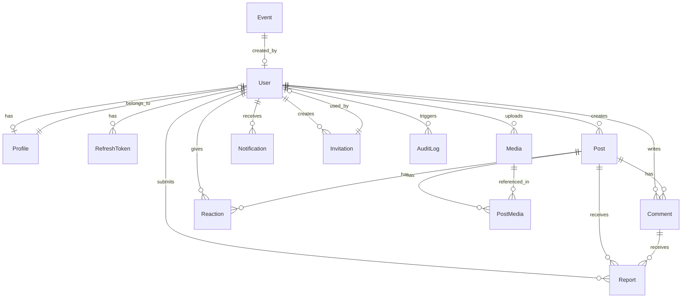

# StagApp Data Model

> Defines the core entities, relationships, and data architecture.
> Do NOT generate migrations until the schema is finalized and approved.

---

## ER Diagram

---

## Entity Definitions

### User

**Purpose:** Core identity entity. Represents an authenticated account.

| Field | Type | Constraints | Notes |
|-------|------|-------------|-------|
| id | cuid2 | PK | Generated, immutable |
| email | string(254) | UNIQUE, NOT NULL | Lowercase normalized |
| password_hash | string | NOT NULL | Bcrypt hash |
| email_verified | boolean | NOT NULL, DEFAULT false | |
| email_verification_token | string | NULLABLE | Hashed, single-use |
| email_verification_expires | timestamp | NULLABLE | |
| password_reset_token | string | NULLABLE | Hashed, single-use |
| password_reset_expires | timestamp | NULLABLE | |
| status | enum | NOT NULL, DEFAULT 'PENDING' | PENDING, ACTIVE, SUSPENDED, DELETED |
| role | enum | NOT NULL, DEFAULT 'PENDING' | PENDING, PLAYER, ALUMNI, COACH, PARENT, ADMIN |
| mfa_enabled | boolean | NOT NULL, DEFAULT false | Future use |
| mfa_secret | string | NULLABLE | Encrypted, future use |
| last_login_at | timestamp | NULLABLE | |
| created_at | timestamp | NOT NULL, DEFAULT now() | |
| updated_at | timestamp | NOT NULL, auto-updated | |
| deleted_at | timestamp | NULLABLE | Soft delete |

**Indexes:** `email` (unique), `status`, `role`, `created_at`

**Relationships:** Has one Profile, has many Posts, Comments, Reactions, Media, Notifications, RefreshTokens

**Authorization:** Users can read their own full record. Other users see only public fields via Profile. Admins can read all fields except password_hash and mfa_secret.

**Deletion Strategy:** Soft delete. Set `status = DELETED`, `deleted_at = now()`. After 30-day grace period, hard delete and anonymize audit logs. Remove media from storage.

---

### Profile

**Purpose:** Public-facing profile information, separate from auth-sensitive User fields.

| Field | Type | Constraints | Notes |
|-------|------|-------------|-------|
| id | cuid2 | PK | |
| user_id | cuid2 | FK -> User, UNIQUE | One profile per user |
| display_name | string(50) | NOT NULL | |
| first_name | string(50) | NOT NULL | |
| last_name | string(50) | NOT NULL | |
| bio | string(500) | NULLABLE | |
| avatar_url | string | NULLABLE | Signed URL generated on read |
| avatar_media_id | cuid2 | FK -> Media, NULLABLE | |
| position | string(50) | NULLABLE | For players/alumni |
| jersey_number | integer | NULLABLE | For players |
| graduation_year | integer | NULLABLE | For players/alumni |
| coaching_title | string(100) | NULLABLE | For coaches |
| city | string(100) | NULLABLE | For alumni (current location) |
| verification_note | string(500) | NULLABLE | Submitted during verification |
| created_at | timestamp | NOT NULL | |
| updated_at | timestamp | NOT NULL | |

**Indexes:** `user_id` (unique), `display_name`, `graduation_year`

**Relationships:** Belongs to User, optionally references Media (avatar)

**Authorization:** Owner can read/update all fields. Other ACTIVE members can read public fields. Admins can read all fields.

**Deletion Strategy:** Cascade delete with User.

---

### RefreshToken

**Purpose:** Tracks issued refresh tokens for rotation and revocation.

| Field | Type | Constraints | Notes |
|-------|------|-------------|-------|
| id | cuid2 | PK | |
| user_id | cuid2 | FK -> User, NOT NULL | |
| token_hash | string | NOT NULL, UNIQUE | SHA-256 hash of token |
| device_info | string(255) | NULLABLE | User agent / device description |
| expires_at | timestamp | NOT NULL | 30-day expiry |
| revoked_at | timestamp | NULLABLE | Set on revocation |
| created_at | timestamp | NOT NULL | |

**Indexes:** `token_hash` (unique), `user_id`, `expires_at`

**Relationships:** Belongs to User

**Authorization:** System-only access. Users cannot query this table directly.

**Deletion Strategy:** Hard delete expired and revoked tokens via scheduled job (weekly).

---

### Post

**Purpose:** Community content shared by members.

| Field | Type | Constraints | Notes |
|-------|------|-------------|-------|
| id | cuid2 | PK | |
| author_id | cuid2 | FK -> User, NOT NULL | |
| body | text | NOT NULL, 1-5000 chars | Plain text |
| is_pinned | boolean | NOT NULL, DEFAULT false | Pinned announcements |
| pinned_by | cuid2 | FK -> User, NULLABLE | Who pinned it |
| pinned_at | timestamp | NULLABLE | |
| comment_count | integer | NOT NULL, DEFAULT 0 | Denormalized counter |
| reaction_count | integer | NOT NULL, DEFAULT 0 | Denormalized counter |
| created_at | timestamp | NOT NULL | |
| updated_at | timestamp | NOT NULL | |
| deleted_at | timestamp | NULLABLE | Soft delete |

**Indexes:** `author_id`, `created_at DESC`, `is_pinned`, `deleted_at`

**Relationships:** Belongs to User (author), has many Comments, Reactions, PostMedia

**Authorization:** All ACTIVE members can read. Author can update/delete own. Admin can delete any. Coach/Admin can pin.

**Deletion Strategy:** Soft delete. Associated media marked for cleanup on hard delete.

---

### PostMedia

**Purpose:** Join table linking posts to media attachments.

| Field | Type | Constraints | Notes |
|-------|------|-------------|-------|
| id | cuid2 | PK | |
| post_id | cuid2 | FK -> Post, NOT NULL | |
| media_id | cuid2 | FK -> Media, NOT NULL | |
| sort_order | integer | NOT NULL, DEFAULT 0 | Display order |

**Indexes:** `post_id`, `(post_id, media_id)` unique

**Relationships:** Belongs to Post and Media

**Deletion Strategy:** Cascade with Post.

---

### Comment

**Purpose:** User comments on posts.

| Field | Type | Constraints | Notes |
|-------|------|-------------|-------|
| id | cuid2 | PK | |
| post_id | cuid2 | FK -> Post, NOT NULL | |
| author_id | cuid2 | FK -> User, NOT NULL | |
| body | text | NOT NULL, 1-2000 chars | Plain text |
| created_at | timestamp | NOT NULL | |
| updated_at | timestamp | NOT NULL | |
| deleted_at | timestamp | NULLABLE | Soft delete |

**Indexes:** `post_id`, `author_id`, `created_at`

**Relationships:** Belongs to Post and User

**Authorization:** All ACTIVE members can read. Author can delete own. Admin can delete any.

**Deletion Strategy:** Soft delete. Decrement Post.comment_count.

---

### Reaction

**Purpose:** User reactions on posts (like, celebrate, support).

| Field | Type | Constraints | Notes |
|-------|------|-------------|-------|
| id | cuid2 | PK | |
| post_id | cuid2 | FK -> Post, NOT NULL | |
| user_id | cuid2 | FK -> User, NOT NULL | |
| type | enum | NOT NULL | LIKE, CELEBRATE, SUPPORT |
| created_at | timestamp | NOT NULL | |

**Indexes:** `(post_id, user_id)` unique, `post_id`

**Relationships:** Belongs to Post and User

**Authorization:** ACTIVE members can create/delete own. One per user per post.

**Deletion Strategy:** Hard delete. Decrement Post.reaction_count.

---

### Media

**Purpose:** Uploaded media files (images, videos).

| Field | Type | Constraints | Notes |
|-------|------|-------------|-------|
| id | cuid2 | PK | |
| uploader_id | cuid2 | FK -> User, NOT NULL | |
| type | enum | NOT NULL | IMAGE, VIDEO |
| status | enum | NOT NULL, DEFAULT 'PROCESSING' | PROCESSING, READY, FAILED, DELETED |
| original_filename | string(255) | NOT NULL | For reference only, never used in storage |
| storage_key | string | NOT NULL, UNIQUE | Path in object storage |
| storage_key_thumb | string | NULLABLE | Thumbnail path |
| storage_key_medium | string | NULLABLE | Medium size path |
| mime_type | string(100) | NOT NULL | Validated MIME type |
| file_size | bigint | NOT NULL | Bytes |
| width | integer | NULLABLE | Pixels |
| height | integer | NULLABLE | Pixels |
| duration | integer | NULLABLE | Seconds (video only) |
| created_at | timestamp | NOT NULL | |

**Indexes:** `uploader_id`, `storage_key` (unique), `status`

**Relationships:** Belongs to User (uploader), referenced by PostMedia and Profile (avatar)

**Authorization:** Uploader and admins can manage. All ACTIVE members can view (via signed URLs).

**Deletion Strategy:** Mark as DELETED, background job removes files from storage.

---

### Event

**Purpose:** Team events, games, practices, and community events.

| Field | Type | Constraints | Notes |
|-------|------|-------------|-------|
| id | cuid2 | PK | |
| created_by | cuid2 | FK -> User, NOT NULL | |
| title | string(200) | NOT NULL | |
| description | text | NULLABLE, max 2000 chars | |
| event_type | enum | NOT NULL | GAME, PRACTICE, SOCIAL, OTHER |
| start_time | timestamp | NOT NULL | |
| end_time | timestamp | NULLABLE | |
| location | string(300) | NULLABLE | |
| is_cancelled | boolean | NOT NULL, DEFAULT false | |
| created_at | timestamp | NOT NULL | |
| updated_at | timestamp | NOT NULL | |

**Indexes:** `start_time`, `event_type`, `created_by`

**Relationships:** Belongs to User (creator)

**Authorization:** Coach/Admin can create/update/delete. All ACTIVE members can view.

**Deletion Strategy:** Hard delete (events are factual records managed by coaches/admins).

---

### Notification

**Purpose:** In-app notifications for user activity.

| Field | Type | Constraints | Notes |
|-------|------|-------------|-------|
| id | cuid2 | PK | |
| user_id | cuid2 | FK -> User, NOT NULL | Recipient |
| type | enum | NOT NULL | COMMENT, REACTION, ANNOUNCEMENT, EVENT_REMINDER, MEMBERSHIP_APPROVED, CONTENT_REMOVED |
| title | string(200) | NOT NULL | |
| body | string(500) | NULLABLE | |
| data | jsonb | NULLABLE | Structured payload (post_id, event_id, etc.) |
| is_read | boolean | NOT NULL, DEFAULT false | |
| created_at | timestamp | NOT NULL | |

**Indexes:** `user_id`, `(user_id, is_read)`, `created_at DESC`

**Relationships:** Belongs to User (recipient)

**Authorization:** Users can only read/update their own notifications.

**Deletion Strategy:** Auto-delete after 90 days via scheduled job.

---

### Invitation

**Purpose:** Invitation codes for new member onboarding.

| Field | Type | Constraints | Notes |
|-------|------|-------------|-------|
| id | cuid2 | PK | |
| code | string(32) | NOT NULL, UNIQUE | Cryptographically random |
| created_by | cuid2 | FK -> User, NOT NULL | |
| suggested_role | enum | NULLABLE | Suggested role for invitee |
| max_uses | integer | NOT NULL, DEFAULT 1 | 0 = unlimited |
| use_count | integer | NOT NULL, DEFAULT 0 | |
| used_by | cuid2[] | NULLABLE | Array of user IDs who used it |
| expires_at | timestamp | NOT NULL | |
| is_active | boolean | NOT NULL, DEFAULT true | |
| created_at | timestamp | NOT NULL | |

**Indexes:** `code` (unique), `created_by`, `expires_at`

**Relationships:** Belongs to User (creator)

**Authorization:** Admin/Coach can create. Anyone with the code can use it.

**Deletion Strategy:** Soft deactivate (set `is_active = false`). Retain for audit trail.

---

### Report

**Purpose:** Content or user reports submitted by members.

| Field | Type | Constraints | Notes |
|-------|------|-------------|-------|
| id | cuid2 | PK | |
| reporter_id | cuid2 | FK -> User, NOT NULL | |
| target_type | enum | NOT NULL | POST, COMMENT, USER |
| target_id | cuid2 | NOT NULL | ID of reported entity |
| reason | enum | NOT NULL | SPAM, HARASSMENT, INAPPROPRIATE, OTHER |
| description | text | NULLABLE, max 500 chars | |
| status | enum | NOT NULL, DEFAULT 'PENDING' | PENDING, REVIEWED, DISMISSED, ACTIONED |
| reviewed_by | cuid2 | FK -> User, NULLABLE | Admin who reviewed |
| reviewed_at | timestamp | NULLABLE | |
| admin_note | text | NULLABLE | |
| created_at | timestamp | NOT NULL | |

**Indexes:** `(reporter_id, target_type, target_id)` unique, `status`, `created_at`

**Relationships:** Belongs to User (reporter), polymorphic target

**Authorization:** ACTIVE members can create. Admins can view and review. Reporter can see own report status.

**Deletion Strategy:** Retain indefinitely for moderation history.

---

### AuditLog

**Purpose:** Immutable record of security-relevant actions.

| Field | Type | Constraints | Notes |
|-------|------|-------------|-------|
| id | cuid2 | PK | |
| actor_id | cuid2 | NULLABLE | NULL for system actions |
| action | string(100) | NOT NULL | e.g., 'USER_LOGIN', 'MEMBER_APPROVED' |
| target_type | string(50) | NULLABLE | e.g., 'User', 'Post' |
| target_id | cuid2 | NULLABLE | |
| metadata | jsonb | NULLABLE | Additional context |
| ip_address | string(45) | NULLABLE | Hashed or last octet only |
| user_agent | string(255) | NULLABLE | |
| created_at | timestamp | NOT NULL | Immutable |

**Indexes:** `actor_id`, `action`, `target_type + target_id`, `created_at`

**Relationships:** References User (actor) but no FK constraint (logs survive user deletion)

**Authorization:** Admin read-only. No updates or deletes via application.

**Deletion Strategy:** Archive after 2 years. Anonymize actor references if associated user was hard-deleted.

---

## Future Entities (Not Yet Designed)

These entities will be needed when the corresponding features are implemented:

| Entity | Feature | Priority |
|--------|---------|----------|
| Conversation | Direct messaging | P2 |
| ConversationMember | Direct messaging | P2 |
| Message | Direct messaging | P2 |
| PushToken | Push notifications | P1 |
| NotificationPreference | Push notifications | P1 |
| Group | Private groups | P2 |
| GroupMember | Private groups | P2 |
| Payment | Donations/payments | Future |
| Donation | Fundraising | Future |

---

## Conventions

- **IDs:** All primary keys use `cuid2` (collision-resistant, URL-safe, not guessable)
- **Timestamps:** All entities have `created_at`. Most have `updated_at`. Soft-deletable entities have `deleted_at`.
- **Enums:** Defined as PostgreSQL enums or string enums in Prisma
- **Soft delete:** Query filters must exclude soft-deleted records by default (`WHERE deleted_at IS NULL`)
- **Denormalized counters:** `comment_count` and `reaction_count` on Post are updated via triggers or application logic. Accept eventual consistency.
- **No cascade deletes in database.** Handle deletion logic in application code to ensure proper cleanup (media deletion, counter updates, audit logging).
