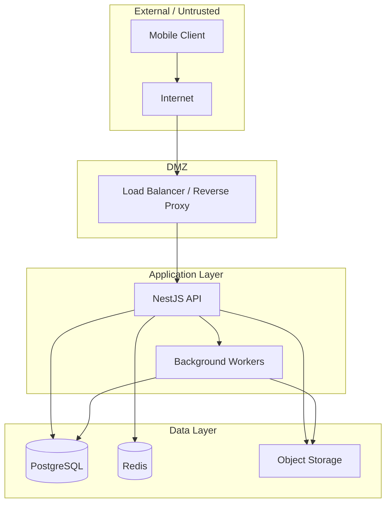

# StagApp Threat Model

> Initial threat model using STRIDE methodology.
> Review and update as features are implemented.

---

## Assets

| Asset | Sensitivity | Description |
|-------|------------|-------------|
| User credentials | Critical | Email, password hash, MFA secrets |
| User PII | High | Names, email, phone, location |
| Private media | High | Photos/videos of members (potentially minors) |
| Community content | Medium | Posts, comments, reactions |
| Direct messages (future) | High | Private conversations |
| Admin access | Critical | Ability to manage all users and content |
| JWT signing keys | Critical | Compromise enables token forgery |
| Database | Critical | All application data |
| Audit logs | High | Security-relevant event history |
| Invitation codes | Medium | Can be used to initiate membership |

---

## Actors

| Actor | Description | Motivation |
|-------|------------|-----------|
| Authenticated member | Verified community member | Curiosity, grudge, accidental misuse |
| Pending user | Registered but not approved | Gain unauthorized access to community |
| External attacker | No account | Data theft, scraping, vandalism |
| Disgruntled member | Formerly active, suspended or removed | Revenge, data exfiltration |
| Compromised admin | Admin account taken over | Full system compromise |
| Insider threat | Developer or operator | Data access, backdoor |
| Automated bot | Script or bot | Spam, credential stuffing, scraping |

---

## Entry Points

| Entry Point | Protocol | Auth Required | Trust Level |
|-------------|----------|---------------|-------------|
| Mobile app API | HTTPS | Varies | Untrusted client |
| Auth endpoints | HTTPS | No | Public |
| Protected API endpoints | HTTPS | JWT | Verified user |
| Admin API endpoints | HTTPS | JWT + Admin role | Trusted |
| Pre-signed upload URLs | HTTPS | Pre-authorized | Limited |
| Health check endpoint | HTTPS | No | Public |
| WebSocket (future) | WSS | JWT | Verified user |

---

## Trust Boundaries

**Trust boundary crossings:**
1. Client -> API: All input untrusted, must validate
2. API -> Database: Parameterized queries only (via Prisma)
3. API -> Storage: Signed URLs, validated file types
4. User role transitions: Pending -> Active (requires admin approval)

---

## STRIDE Analysis

### S — Spoofing

| Threat | Severity | Description | Mitigation |
|--------|----------|-------------|-----------|
| S1: Credential stuffing | HIGH | Attacker uses leaked credential lists | Rate limiting on login (5/15min), breached password check, account lockout |
| S2: Token theft | HIGH | Attacker steals JWT from device | Short-lived access tokens (15min), secure storage (SecureStore), refresh token rotation |
| S3: Session hijacking | HIGH | Attacker uses stolen refresh token | Refresh token rotation, revocation on anomaly, device tracking |
| S4: Impersonation | MEDIUM | Attacker creates account pretending to be someone | Admin verification required, invitation system |
| S5: Admin impersonation | CRITICAL | Attacker gains admin access | Strong passwords, MFA (post-MVP), audit logging, session monitoring |

### T — Tampering

| Threat | Severity | Description | Mitigation |
|--------|----------|-------------|-----------|
| T1: Request tampering | MEDIUM | Modify request to change other users' data | Object-level authorization on every write, ownership verification |
| T2: JWT tampering | HIGH | Forge or modify JWT claims | RS256/EdDSA signing, validate signature server-side |
| T3: File upload tampering | MEDIUM | Upload malicious file disguised as image | Magic byte validation, MIME checking, file size limits, EXIF stripping |
| T4: Parameter pollution | LOW | Inject extra parameters into requests | DTO validation with whitelist (class-validator), strip unknown fields |
| T5: Database tampering | CRITICAL | Direct database modification | No public database access, parameterized queries, network isolation |

### R — Repudiation

| Threat | Severity | Description | Mitigation |
|--------|----------|-------------|-----------|
| R1: Deny admin actions | MEDIUM | Admin denies performing moderation action | Immutable audit log for all admin actions |
| R2: Deny content creation | LOW | User denies creating offensive content | Audit log for content creation, soft deletes preserve records |
| R3: Deny login | LOW | User denies logging in (account compromise claim) | Login audit log with IP and device info |

### I — Information Disclosure

| Threat | Severity | Description | Mitigation |
|--------|----------|-------------|-----------|
| I1: IDOR / BOLA | CRITICAL | Access other users' private data via ID manipulation | Object-level authorization on every read, return 404 not 403 |
| I2: Account enumeration | MEDIUM | Determine which emails have accounts | Generic error messages, consistent timing, no existence signals |
| I3: Media hotlinking | HIGH | Access private photos/videos without authentication | Signed URLs with expiration, no public storage buckets |
| I4: Error information leakage | MEDIUM | Stack traces or internal details in error responses | Generic error messages in production, structured error responses |
| I5: Data scraping | MEDIUM | Authenticated user systematically downloads all content | Rate limiting, pagination limits, monitoring for scraping patterns |
| I6: EXIF data exposure | MEDIUM | GPS coordinates in photos expose member locations | Strip EXIF metadata from all uploaded images |
| I7: Log data leakage | LOW | Sensitive data in application logs | Never log passwords, tokens, or PII; log user IDs only |

### D — Denial of Service

| Threat | Severity | Description | Mitigation |
|--------|----------|-------------|-----------|
| D1: API abuse | MEDIUM | Flood API with requests | Rate limiting per user and per IP, request size limits |
| D2: Large file upload | MEDIUM | Upload extremely large files to exhaust storage | File size limits, pre-signed URL size restrictions |
| D3: Comment/post spam | MEDIUM | Flood feed with spam content | Rate limiting on creation, report system, admin moderation |
| D4: Account creation spam | LOW | Mass account registration | Rate limiting on registration, invitation system, admin approval |
| D5: Notification spam | MEDIUM | Trigger excessive notifications | Rate limit notification-generating actions, batch notifications |

### E — Elevation of Privilege

| Threat | Severity | Description | Mitigation |
|--------|----------|-------------|-----------|
| E1: Role self-assignment | CRITICAL | User changes own role to admin | Roles managed server-side only, role changes require admin action with audit log |
| E2: Pending user bypass | HIGH | Pending user accesses community content | Status check on every protected endpoint (middleware guard) |
| E3: Coach privilege escalation | HIGH | Coach accesses admin-only endpoints | Strict role guard on admin endpoints, separate route prefix |
| E4: Suspended user access | HIGH | Suspended user retains access | Immediate token revocation on suspension, status check on token refresh |
| E5: Invitation code privilege | MEDIUM | Use invitation to get elevated role | Invitation suggests role but admin always approves final role assignment |

---

## Abuse Cases

### AC-1: Unauthorized Community Access
**Scenario:** Outsider creates account and bypasses verification to view private content.
**Severity:** HIGH
**Mitigations:**
- All community endpoints require ACTIVE membership status
- Admin manual approval for all new members
- No self-service role assignment

### AC-2: Content Scraping by Member
**Scenario:** Verified member systematically downloads all photos and member data.
**Severity:** MEDIUM
**Mitigations:**
- Rate limiting on media URL generation and API endpoints
- Monitoring for unusual access patterns (many profile views in short time)
- Signed URLs with short expiration
- Consider watermarking photos (future)

### AC-3: Harassment via Posts/Comments
**Scenario:** Member posts harassing or inappropriate content targeting another member.
**Severity:** MEDIUM
**Mitigations:**
- Report system for flagging content
- Admin moderation queue and tools
- Account suspension capability
- Audit trail of all content

### AC-4: Admin Account Compromise
**Scenario:** Attacker gains access to admin account via credential theft or social engineering.
**Severity:** CRITICAL
**Mitigations:**
- Strong password requirements for admins (14+ chars)
- MFA for admin accounts (post-MVP, high priority)
- All admin actions audit logged
- Admin session shorter timeout
- Alert on unusual admin activity patterns (future)
- Limit number of admin accounts

### AC-5: Malicious File Upload
**Scenario:** User uploads file containing malware or exploit disguised as an image.
**Severity:** MEDIUM
**Mitigations:**
- Magic byte MIME validation (not Content-Type header)
- File size limits
- EXIF stripping
- Random filename generation
- Serve media from separate domain/origin
- ClamAV scanning (post-MVP)

### AC-6: Mass Invitation Abuse
**Scenario:** Someone with invitation privileges generates codes and shares them publicly.
**Severity:** MEDIUM
**Mitigations:**
- Rate limit invitation creation
- Track invitation chains (who created, who used)
- All invitations still require admin approval for membership
- Ability to deactivate all invitations from a specific creator

### AC-7: Notification Bombing
**Scenario:** User repeatedly comments/reacts on posts to flood another user with notifications.
**Severity:** LOW
**Mitigations:**
- Rate limit post interactions
- Batch notifications (e.g., "User X and 5 others commented on your post")
- Report system for harassment

---

## Risk Summary (Ranked by Severity)

| # | Risk | Severity | Status |
|---|------|----------|--------|
| 1 | Admin account compromise (AC-4) | CRITICAL | Mitigate: strong auth, MFA, audit logging |
| 2 | IDOR/BOLA data exposure (I1) | CRITICAL | Mitigate: object-level auth on every endpoint |
| 3 | Role/privilege escalation (E1-E4) | CRITICAL | Mitigate: server-side RBAC, status guards |
| 4 | Credential stuffing (S1) | HIGH | Mitigate: rate limiting, breached password check |
| 5 | Token theft/hijacking (S2, S3) | HIGH | Mitigate: short-lived tokens, rotation, secure storage |
| 6 | Unauthorized community access (AC-1) | HIGH | Mitigate: admin approval, status enforcement |
| 7 | Private media exposure (I3) | HIGH | Mitigate: signed URLs, no public buckets |
| 8 | Content scraping (AC-2, I5) | MEDIUM | Mitigate: rate limiting, monitoring |
| 9 | Malicious upload (AC-5) | MEDIUM | Mitigate: validation, scanning |
| 10 | Harassment/spam (AC-3, D3) | MEDIUM | Mitigate: moderation tools, reporting |

---

## Review Schedule

- Review this threat model when:
  - New features are added (especially messaging, payments)
  - Security incidents occur
  - Major architectural changes are made
  - Quarterly, at minimum
